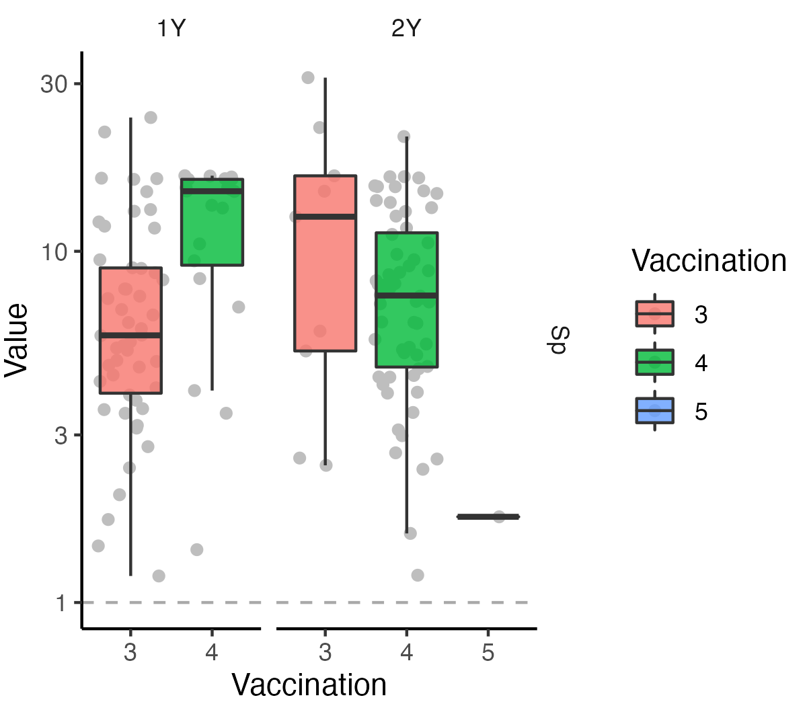

```{r ChunkOption, include = FALSE, warning = FALSE}
# chunk option
knitr::opts_chunk$set(echo = FALSE, # chunkを出力として表示するか否か
                      eval = FALSE, # chunkを実際にRのコードとして評価するか否か
                      warning = FALSE, # chunkに対する警告を表示させるか否か
                      message = FALSE, # chunkに対するエラーを表示させるか否か
                      comment = "", # 計算結果の頭につく文字
                      cache = FALSE ) 

Sys.setlocale("LC_ALL", 'UTF-8')
options(scipen = 10)
```


```{R}
# Packages
source("~/Git/Database/Common/Library_Basic.R" )
source("~/Git/Database/Common/Library_Bioinformatics.R")
source("~/Git/Database/Common/Function.R")
source("~/Git/Database/Common/Function_Mb.R")

readRDS("../RKcohort/OBJ/Mb.obj") -> Mb_list
# source("~/Git/Database/RIKENcohort/RIKENcohort_Function.R")
# source("~/Git/Database/RIKENcohort/RIKENcohort_Clinicaldata.R")
# source("~/Git/Database/RIKENcohort/RIKENcohort_Vaccine.R")

```

```{R}
# Vacccine
Antibody_tbl %>% 
  mutate(Variable = paste(Variable, "Titer", sep = "_")) %>% 
  unite_var %>% 
  spread(Variable, Value) %>% 
  c2r("SubjectID") -> Antibody_df

SubjectID_Ab <- rownames(Antibody_df)

Vaccination_tbl %>% 
  mutate(Variable = paste(Variable, "Vaccination", sep = "_")) %>% 
  unite_var %>% 
  spread(Variable, Value) %>% 
  c2r("SubjectID") -> Vaccination_df

Antibody_tbl %>% 
   filter(Age != "UCB") %>% 
  inner_join(Vaccination_tbl %>% 
               spread(Age, Value) %>% 
               mutate(`5Y` = `2Y`,
                      `7Y` = `2Y`) %>% 
               select(-`6M`) %>% 
               gather(Age, Vaccination,
                      -SubjectID, -Variable)) %>% 
  mutate(Positive = if_else(Value >= 1, "1", "0")) %>% 
  c2f -> AbVac_tbw

# NP
Nasopharynx_tbw %>% 
  select(-Quantative, -Most_Abundant_Species) %>% 
  c2r("SubjectID") %>% 
  mutate_all(as.character) %>% 
  mutate_all(as.numeric) -> Nasopharynx_df

# Mb
readr::read_csv("../RKcohort_DMM/MicrobiotaAge.csv") -> MA_tbl

readr::read_csv("../RKcohort_DMM/CSV/Enterotype.csv") %>%
  gather(Variable, Value, -SubjectID, -Age) %>% 
  filter(!grepl("KS", SubjectID)) %>% 
  rename(Variable_Feces = Variable,
         Age_Feces = Age,
         Value_Feces = Value) %>% 
  c2f  -> Enterotype_tbl

MA_tbl %>% 
               rename(Age_Feces = Age) %>% 
               select(-Chronologic_Age, -MAZ) %>% 
  filter(!grepl("KS", SubjectID)) %>% 
               gather(Variable_Feces, Value_Feces,
                      -SubjectID, -Age_Feces) %>% 
               c2f %>% 
               bind_rows(Alpha_tbl,
                         Enterotype_tbl) -> Mb_tbl

Mb_tbl %>% 
  unite(Variable, Variable_Feces, Age_Feces, sep = "@") %>% 
  spread(Variable, Value_Feces) %>% 
  c2r("SubjectID") -> Mb_df

## Genus
Mb_list$genus2 %>% 
  filter(!grepl("KS", SubjectID)) %>% 
  filter(SubjectID %in% SubjectID_Ab) -> Genus_tbl

Mb_list$otu %>% 
  filter(!grepl("KS", SubjectID)) %>% 
  filter(SubjectID %in% SubjectID_Ab) -> OTU_tbl

# Merge
AbVac_tbw %>% 
  inner_join(Mb_tbl) %>% 
  mutate(Age_Feces = fct_relevel_age(Age_Feces)) -> AbVacMb_tbw
```

# Basic analysis
## Sample number

```{R}
AbVacMb_tbw %>% 
  group_by(SubjectID, Variable, Age_Feces) %>% 
  summarise() %>% 
  group_by(Variable, Age_Feces) %>% 
  summarise(Count = n()) %>% 
  spread(Variable, Count) %>% 
  arrange(Age_Feces) %>% 
  table2png("Vaccine/Table_SampleNumber.png")
```


## LRTI
```{R}
LRTI_tbl %>% 
  group_by(Age, Value) %>% 
  summarise(Count = n()) %>% 
  ggplot(., aes(x = Age, y = Count, fill = Value))+
  geom_bar(stat = "identity")
ggsave("Vaccine/Barplot_Age_LRTI.png",
       dpi = 300, h = 2.5, w = 2.5)
```


## Vaccination
```{R}
Vaccination_tbl %>% 
  mutate(Value = as.factor(Value)) %>% 
  group_by(Age, Variable, Value) %>% 
  summarise(Count = n()) %>% 
  mutate(Age = fct_relevel_age(Age)) %>%
  
  ggplot(., aes(x = Age, y = Count, fill = Value))+
  geom_bar(stat = "identity",
           position = position_stack(reverse = TRUE))+
  facet_wrap(~ Variable)+
  scale_fill_brewer(palette = "blue")
ggsave("Vaccine/Barplot_Age_Vaccination.png",
       dpi = 300, h = 2.5, w = 4)
```


## Antibody
```{R}
Antibody_tbl %>% 
  ggplot(., aes(x = Age, y = Value, fill = Age))+
  geom_hline(yintercept = 1,
             color = "darkgray",
             linetype = "dashed")+
  geom_jitter(color = "gray")+
  geom_boxplot(alpha = 0.8, outlier.shape = NA)+
  facet_wrap(~ Variable, scale = "free_y")+
  scale_y_log10()
ggsave("Vaccine/Boxplot_Age_Antibody.png",
       dpi = 300, h = 2.5 , w = 5)
```


## Positive
```{R}
AbVac_tbw %>% 
  group_by(Variable, Age, Positive) %>% 
  summarise(Count = n()) %>% 
  
  ggplot(., aes(x = Age, y = Count, fill = Positive))+
  geom_bar(stat = "identity", position = "fill")+
  facet_wrap(~ Variable)
ggsave("Vaccine/Barplot_Age_Positive.png",
       dpi = 300, h = 2.5, w = 4)
```

## Angtibody + Vaccination
```{R}
AbVac_tbw %>% 
  mutate(Vaccination = as.factor(Vaccination)) %>% 
  
  ggplot(., aes(x = Vaccination, y = Value, fill = Vaccination))+
  geom_hline(yintercept = 1,
             color = "darkgray",
             linetype = "dashed")+
  geom_jitter(color = "gray")+
  geom_boxplot(alpha = 0.8, outlier.shape = NA)+
  facet_grid(Variable ~ Age, scale = "free", space = "free_x")+
  scale_y_log10()
ggsave("Vaccine/Boxplot_Vaccination_Antibody_Age.png",
       dpi = 300, h = 3.5, w = 4)
```


# Correlatinon analysis
## Nasopharyngeal vs. Antibody
```{R}
intersect(rownames(Antibody_df),
          rownames(Nasopharynx_df)) -> SubjectID_AbNP

associate_r(Nasopharynx_df[SubjectID_AbNP, ],
                      Antibody_df[SubjectID_AbNP, ],
            method = "spearman",
            p.adj.method = "none") %>% 
  make_list_pheatmap -> Associate_AbNP_list

pheatmap(Associate_AbNP_list$cor,
         display_numbers = Associate_AbNP_list$sd,
         fontsize_number = 14,
         cutree_rows = 7,
         cluster_rows = FALSE,
         cutree_cols = 5,
         file = "Vaccine/Heatmap_Ab_NP.png",
         res = 300,
         h = 3, w = 4.5)
```


## Gut microbiota vs. Antibody
```{R}
intersect(rownames(Antibody_df),
          rownames(Mb_df)) -> SubjectID_AbMb

associate_r(Mb_df[SubjectID_AbMb, ],
                      Antibody_df[SubjectID_AbMb, ],
            method = "spearman",
            p.adj.method = "none") %>% 
  make_list_pheatmap -> Associate_AbMb_list

Mb_df %>% 
  names %>% 
  data.frame(Variable = .,
             Variable2 = .) %>% 
  separate_var %>% 
  mutate(Age = droplevels(Age)) %>% 
  mutate(Variable = fct_relevel(Variable,
                                "ObservedOTU", "Chao1", "Shannon")) %>% 
  arrange(Age, Variable) %>% 
  c2r("Variable2") -> Annotation_Row_df

pheatmap(Associate_AbMb_list$cor[rownames(Annotation_Row_df), ],
         display_numbers = Associate_AbMb_list$sd,
         annotation_row = Annotation_Row_df[, -1, drop = FALSE],
         fontsize_number = 14,
         # cutree_rows = 7,
         cluster_rows = FALSE,
         cutree_cols = 5,
         gaps_row = c(5, 10, 15, 20),
         file = "Vaccine/Heatmap_Ab_Mb.png",
         res = 300,
         h = 6, w = 5.)
```


## Envfit: Genus
```{R}
set.seed(1202)

Genus_tbl %>%
  spread(Variable, Value) %>%
  mutate(Age = droplevels(Age)) %>% 
  split(., .$Age) %>% 
  map(~ select(.x, -Age)) %>% 
  map(~ c2r(., "SubjectID")) -> Genus_list

map(Genus_list, function(df){
  
  intersect(rownames(Antibody_df),
            rownames(df)) -> sampleid_mutual
  
  df[sampleid_mutual, ] %>% 
  as.matrix %>% 
  metaMDS(.,
        distance = "bray") -> nmds

envfit(nmds,
       Antibody_df[sampleid_mutual, ],  
       permutations = 999,
       na.rm = TRUE)}) -> Envfit_Genus_list

map(1:length(Envfit_Genus_list), function(i){
  Envfit_Genus_list[[i]] -> envfit
  
  envfit %>% 
    .$vectors -> vectorfit
  
    data.frame(P.value = vectorfit$pvals,
               R2 = vectorfit$r,
               Age_Feces = names(Envfit_Genus_list)[i]) %>% 
      r2c("Variable")}) %>%
  do.call(bind_rows, .) -> Envfit_Genus_tbw
```

```{R}
Envfit_Genus_tbw %>% 
  #mutate(Variable = gsub("@.*", "", Variable)) %>% 
  #mutate(Variable = gsub("Nutritional:", "", Variable)) %>% 
  dplyr::select(-P.value) %>% 
  mutate(R2 = if_else(R2 == 0, 10^(-6), R2)) %>% 
  mutate(R2 = log(R2, 10)) %>% 
  spread(Variable, R2) %>% 
  c2r("Age_Feces") -> Envfit_Genus_R2_df

Envfit_Genus_tbw %>% 
  dplyr::select(-R2) %>% 
  mutate(P.value = add_sd(P.value)) %>% 
  spread(Variable, P.value) %>% 
  c2r("Age_Feces") -> Envfit_Genus_SD_df

Envfit_Genus_SD_df[is.na(Envfit_Genus_SD_df)] <- ""

pheatmap::pheatmap(Envfit_Genus_R2_df,
                   display_numbers = Envfit_Genus_SD_df, 
                   # annotation_col = Envfit_Category_df,
                   fontsize_number = 14,
                   file = "Vaccine/Heatmap_Envfit_Genus.png",
                   cutree_cols = 6,
                   na_col = "black",
                   angle_col = 90,
                   gaps_col = 5, 
                   cluster_rows = FALSE,
                   cluster_cols = FALSE,
                   color = colorRampPalette(c("gray40",
                                    "ivory", "orangered"))(100),
                   res = 300, width= 3, height = 2.25)
```


## Envfit: OTU
```{R}
set.seed(1202)

OTU_tbl %>%
  spread(Variable, Value) %>%
  mutate(Age = droplevels(Age)) %>% 
  split(., .$Age) %>% 
  map(~ select(.x, -Age)) %>% 
  map(~ c2r(., "SubjectID")) -> OTU_list

map(OTU_list, function(df){
  
  intersect(rownames(Antibody_df),
            rownames(df)) -> sampleid_mutual
  
  df[sampleid_mutual, ] %>% 
  as.matrix %>% 
  metaMDS(.,
        distance = "bray") -> nmds

envfit(nmds,
       Antibody_df[sampleid_mutual, ],  
       permutations = 999,
       na.rm = TRUE)

}) -> Envfit_OTU_list

map(1:length(Envfit_OTU_list), function(i){
  Envfit_OTU_list[[i]] -> envfit
  
  envfit %>% 
    .$vectors -> vectorfit
  
    data.frame(P.value = vectorfit$pvals,
               R2 = vectorfit$r,
               Age_Feces = names(Envfit_OTU_list)[i]) %>% 
      r2c("Variable")}) %>%
  do.call(bind_rows, .) -> Envfit_OTU_tbw
```


```{R}
Envfit_OTU_tbw %>% 
  #mutate(Variable = gsub("@.*", "", Variable)) %>% 
  #mutate(Variable = gsub("Nutritional:", "", Variable)) %>% 
  dplyr::select(-P.value) %>% 
  mutate(R2 = if_else(R2 == 0, 10^(-6), R2)) %>% 
  mutate(R2 = log(R2, 10)) %>% 
  spread(Variable, R2) %>% 
  c2r("Age_Feces") -> Envfit_OTU_R2_df

Envfit_OTU_tbw %>% 
  dplyr::select(-R2) %>% 
  mutate(P.value = add_sd(P.value)) %>% 
  spread(Variable, P.value) %>% 
  c2r("Age_Feces") -> Envfit_OTU_SD_df

Envfit_OTU_SD_df[is.na(Envfit_OTU_SD_df)] <- ""

pheatmap::pheatmap(Envfit_OTU_R2_df,
                   display_numbers = Envfit_OTU_SD_df, 
                   # annotation_col = Envfit_Category_df,
                   fontsize_number = 14,
                   file = "Vaccine/Heatmap_Envfit_OTU.png",
                   cutree_cols = 6,
                   na_col = "black",
                   angle_col = 90,
                   gaps_col = 5, 
                   cluster_rows = FALSE,
                   cluster_cols = FALSE,
                   color = colorRampPalette(c("gray40",
                                    "ivory", "orangered"))(100),
                   res = 300, width= 3, height = 2.25)
```


```{R}
Envfit_tbw %>% 
  separate_var %>% 
  ggplot(., aes(x = Variable, y = P.value, fill = Variable))+
  geom_jitter(color = "gray")+
  geom_boxplot(outlier.shape = NA,
              alpha = 0.8)+
  scale_y_log10()
```

## Correlaiton genus vs titer
```{R}
map(1:length(Genus_list), function(i){
  Genus_list[[i]] -> df
  
  associate_r(df,
              Antibody_df,
              method = "spearman",
              p.adj.method = "none") %>% 
    make_list_pheatmap -> list
  
  pheatmap(list$cor,
         display_numbers = list$sd,
         # annotation_row = Annotation_Row_df[, -1, drop = FALSE],
         fontsize_number = 14,
         # cutree_rows = 7,
         cluster_rows = FALSE,
         cluster_cols = FALSE,
         cutree_cols = 5,
         gaps_row = c(5, 10, 15, 20),
         file = glue::glue("Vaccine/Heatmap_Ab_Genus_{names(Genus_list)[i]}.png"),
         res = 300,
         h = 50, w = 6)})


```


# Gut microbiota

## Enterotype
```{R}
Antibody_tbl %>% 
  inner_join(Enterotype_tbl) %>% 
  filter(Age_Enterotype %in% c("1M", "1Y", "5Y", "7Y")) -> Antibody_Enterotype_tbl

Antibody_Enterotype_tbl %>% 
  group_by(SubjectID, Age_Enterotype, Enterotype) %>% 
  summarise() %>% 
  group_by(Age_Enterotype, Enterotype) %>% 
  summarise(Count = n())

Antibody_Enterotype_tbl %>% 
  filter(Variable == "Hib") %>% 
  ggplot(., aes(x = Enterotype, y = Value, fill = Age))+
  geom_hline(yintercept = 1,
             color = "darkgray",
             linetype = "dashed")+
  geom_jitter(color = "gray")+
  geom_boxplot(alpha = 0.8, outlier.shape = NA)+
  facet_grid(Age_Enterotype ~ Age, scale = "free", space = "free_x")+
  scale_y_log10()

Antibody_Enterotype_tbl %>% 
  filter(Variable == "Sp") %>% 
  ggplot(., aes(x = Enterotype, y = Value, fill = Age))+
  geom_hline(yintercept = 1,
             color = "darkgray",
             linetype = "dashed")+
  geom_jitter(color = "gray")+
  geom_boxplot(alpha = 0.8, outlier.shape = NA)+
  facet_grid(Age_Enterotype ~ Age, scale = "free", space = "free_x")+
  scale_y_log10()
```


## Titer vs. Mb
```{R}
var = "13CPS"
age_ab = "2Y"
age_f = "1M"
var_f <- Variable_Feces[2]

AbVacMb_tbw %>% 
  check_levels("Variable_Feces") -> Variable_Feces

map(c("SP", "Hib"), function(var){
  map(Variable_Feces, function(var_f){
  map(c("1Y", "2Y", "5Y", "7Y"), function(age_ab){
    map(c("1W", "1M", "1Y", "5Y", "7Y"), function(age_f){
      
      AbVacMb_tbw %>% 
        filter(Variable == var) %>% 
        filter(Variable_Feces == var_f) %>% 
        filter(Age == age_ab) %>% 
        filter(Age_Feces == age_f) %>% 
        glm(Value ~ Value_Feces + Vaccination,
            data = .) %>% 
        broom.mixed::tidy(.,
                    effects = "fixed",
                    conf.int = TRUE,
                    exponentiate = TRUE) %>% 
        filter(term == "Value_Feces") %>% 
        mutate(Age = age_ab,
               Age_Feces = age_f,
               Variable = var,
               Variable_Feces = var_f)
      
      }) %>% 
        do.call(bind_rows, .) }) %>% 
      do.call(bind_rows, .) }) %>% 
    do.call(bind_rows, .) }) %>% 
  do.call(bind_rows, .) -> df

df %>% 
  filter(p.value < 0.05) %>% 
  select(Variable, Age, Age_Feces, Variable_Feces, p.value,
         estimate, conf.low, conf.high)# %>% 
  table2png("Vaccine/Table_Ab_Mb.png")
  
```


```{R}
Antibody_Mb_tbw %>% 
  filter(Variable_Feces == "Microbiota_Age") %>% 
  filter(Age == "1Y") %>%
  filter(Age_Feces == "1Y") %>% 
  ggplot(., aes(x = Value_Feces, y = Value))+
  geom_point()+
  stat_smooth(method = "loess",
              colour = "darkgreen",
              size = 1.0,
              se = TRUE,
              span = 1)+
  #scale_x_log10()+
  facet_wrap(~ Variable, scale = "free_x")+
  theme(strip.text = element_text(size = 12))+
  scale_y_log10()+
  labs(x = "Microbiota age",
       y = "Antibody titer")

Antibody_Mb_tbw %>% 
  filter(Variable == "13CPS") %>% 
  filter(Variable_Feces == "Shannon") %>% 
  filter(Age %in% c("2Y", "7Y")) %>% 
  filter(Age_Feces == "1Y") %>% 
  ggplot(., aes(x = Value_Feces, y = Value))+
  geom_point()+
  stat_smooth(method = "loess",
              colour = "darkgreen",
              size = 1.0,
              se = TRUE,
              span = 1)+
  #scale_x_log10()+
  facet_wrap(~ Age, scale = "free_y")+
  theme(strip.text = element_text(size = 12))+
  scale_y_log10()+
  labs(x = "Microbiota age",
       y = "Antibody titer")
```


## Positive vs. Mb (Hib)
```{R}
map(c("Hib"), function(var){
  map(Variable_Feces, function(var_f){
  map(c("1Y", "2Y", "5Y", "7Y"), function(age_ab){
    map(c("1W", "1M", "1Y", "5Y", "7Y"), function(age_f){
      AbVacMb_tbw %>% 
        filter(Variable == var) %>% 
        filter(Variable_Feces == var_f) %>% 
        filter(Age == age_ab) %>% 
        filter(Age_Feces == age_f) %>% 
        glm(Positive ~ Value_Feces + Vaccination,
            family = "binomial"(link = "logit"),
            data = .) %>% 
        broom.mixed::tidy(.,
                    effects = "fixed",
                    conf.int = TRUE,
                    exponentiate = TRUE) %>% 
        filter(term == "Value_Feces") %>% 
        mutate(Age = age_ab,
               Age_Feces = age_f,
               Variable = var,
               Variable_Feces = var_f)
      }) %>% 
        do.call(bind_rows, .) }) %>% 
      do.call(bind_rows, .) }) %>% 
    do.call(bind_rows, .) }) %>% 
  do.call(bind_rows, .) -> df2

df2 %>% 
  filter(p.value < 0.05) %>% 
  select(Variable, Age, Variable_Feces, Age_Feces,
         estimate, p.value, conf.low, conf.high)
```

