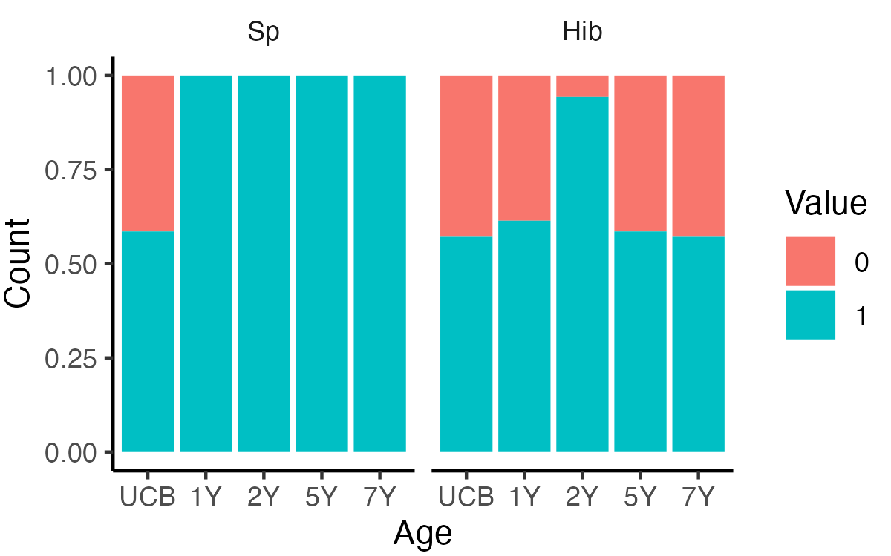

```{r ChunkOption, include = FALSE, warning = FALSE}
# chunk option
knitr::opts_chunk$set(echo = FALSE, # chunkを出力として表示するか否か
                      eval = FALSE, # chunkを実際にRのコードとして評価するか否か
                      warning = FALSE, # chunkに対する警告を表示させるか否か
                      message = FALSE, # chunkに対するエラーを表示させるか否か
                      comment = "", # 計算結果の頭につく文字
                      cache = FALSE ) 

Sys.setlocale("LC_ALL", 'UTF-8')
options(scipen = 10)
```


```{R}
# Packages
source("~/Git/Database/Library/Library_Basic.R" )
source("~/Git/Database/Library/Library_Bioinformatics.R")
source("~/Git/Database/Function/Function.R")
source("~/Git/Database/Function/Function_GE.R")

# source("~/Git/Database/RIKENcohort/RIKENcohort_Function.R")
# source("~/Git/Database/RIKENcohort/RIKENcohort_Clinicaldata.R")
# source("~/Git/Database/RIKENcohort/RIKENcohort_Vaccine.R")
```

```{R}
Titer_tbl %>% 
   filter(Age != "UCB") %>% 
  inner_join(Vaccination_tbl %>% 
               spread(Age, Value) %>% 
               mutate(`5Y` = `2Y`,
                      `7Y` = `2Y`) %>% 
               select(-`6M`) %>% 
               gather(Age, Vaccination,
                      -SubjectID, -Variable)) %>% 
  mutate(Positive = if_else(Value >= 1, "1", "0")) %>% 
  c2f -> TitVac_tbw
```

# Basic analysis
## Sample number
```{R}
AbVacMb_tbw %>% 
  group_by(SubjectID, Variable, Age_Feces) %>% 
  summarise() %>% 
  group_by(Variable, Age_Feces) %>% 
  summarise(Count = n()) %>% 
  spread(Variable, Count) %>% 
  arrange(Age_Feces) %>% 
  table2png("Vaccine/Table_SampleNumber.png")
```


## LRTI
```{R}
LRTI_tbl %>% 
  group_by(Age, Value) %>% 
  summarise(Count = n()) %>% 
  ggplot(., aes(x = Age, y = Count, fill = Value))+
  geom_bar(stat = "identity")
ggsave("Vaccine/Barplot_Age_LRTI.png",
       dpi = 300, h = 2.5, w = 2.5)
```


## Vaccination
```{R}
Vaccination_tbl %>% 
  mutate(Value = as.factor(Value)) %>% 
  group_by(Age, Variable, Value) %>% 
  summarise(Count = n()) %>% 
  mutate(Age = fct_relevel_age(Age)) %>%
  
  ggplot(., aes(x = Age, y = Count, fill = Value))+
  geom_bar(stat = "identity",
           position = position_stack(reverse = TRUE))+
  facet_wrap(~ Variable)+
  scale_fill_brewer(palette = "blue")
ggsave("Vaccine/Barplot_Age_Vaccination.png",
       dpi = 300, h = 2.5, w = 4)
```


## Titer
```{R}
Titer_tbl %>% 
  ggplot(., aes(x = Age, y = Value, fill = Age))+
  geom_hline(yintercept = 1,
             color = "darkgray",
             linetype = "dashed")+
  geom_jitter(color = "gray")+
  geom_boxplot(alpha = 0.8, outlier.shape = NA)+
  facet_wrap(~ Variable, scale = "free_y")+
  scale_y_log10()
ggsave("Vaccine/Boxplot_Age_Titer.png",
       dpi = 300, h = 2.5 , w = 5)
```


## Positive
```{R}
Positive_tbl %>% 
  group_by(Variable, Age, Value) %>% 
  summarise(Count = n()) %>% 
  mutate(Value = as.factor(Value)) %>% 
  ggplot(., aes(x = Age, y = Count, fill = Value))+
  geom_bar(stat = "identity", position = "fill")+
  facet_wrap(~ Variable)
ggsave("Vaccine/Barplot_Age_Positive.png",
       dpi = 300, h = 2.5, w = 4)
```


# Correlation with Antibody
## vs. Vaccination
```{R}
list(Vaccination = Vaccination_df,
     SkinNPMb = SkinNPMb_df,
     GutMb = GutMb_df,
     CR = Species_CR_df) -> Exposure_df_list
```


```{R}
Exposure_df_list[[2]] -> df_ex
future_map(1:length(Exposure_df_list), function(i){
    Exposure_df_list[[i]] -> df_ex
    
    intersect(rownames(Antibody_df),
              rownames(df_ex)) -> subjectid_mutual

associate_r(
            df_ex[subjectid_mutual, ] %>% 
              mutate_all(as.character) %>% 
              mutate_all(as.numeric),
            Antibody_df[subjectid_mutual, ],
            method = "spearman",
            p.adj.method = "none") %>% 
  make_list_pheatmap -> associate_list

associate_list$cor %>% 
  nrow -> nrow

list(c(3),
     c(0),
     c(5, 10, 15, 20),
     c(5, 10, 15, 20)) -> gaps_row_list

associate_list$cor %>% 
  names %>% 
  data.frame(Variable = .) %>% 
  mutate(Type = if_else(grepl("Hib", Variable), "Hib", "Sp")) %>% 
  c2r("Variable") -> annotation_col
  

pheatmap(associate_list$cor,
         display_numbers = associate_list$sd,
         annotation_col = annotation_col,
         fontsize_number = 14,
         #cutree_rows = 7,
         cluster_rows = FALSE,
         cluster_cols = FALSE,
         #cutree_cols = 5,
         gaps_col = c(5, 10, 14, 18, 23, 28, 33, 37, 41, 46), 
         gaps_row = gaps_row_list[[i]],
         file = glue::glue("Vaccine/Heatmap_{names(Exposure_df_list)[i]}.png"),
         res = 300,
         h = 2 + nrow * 0.15, w = 12)
  })
```


## vs. Nasopharyngeal Mb


## vs. Gut microbiota overview


## vs. Cross-reaction microbiota vs. Antibody


```{R}
future_map(4, function(i){
    Exposure_df_list[[i]] -> df_ex
    
    intersect(rownames(Antibody_df),
              rownames(df_ex)) -> subjectid_mutual

associate_r(
            df_ex[subjectid_mutual, ],
            Antibody_df[subjectid_mutual, ],
            method = "spearman",
            p.adj.method = "none") %>% 
  make_list_pheatmap -> associate_list

associate_list$cor %>% 
  nrow -> nrow

associate_list$cor %>% 
  names %>% 
  data.frame(Variable = .) %>% 
  mutate(Type = if_else(grepl("Hib", Variable), "Hib", "Sp")) %>% 
  c2r("Variable") -> annotation_col

associate_list$cor %>% 
  rownames %>% 
  data.frame(Variable = .) %>% 
  mutate(Type = if_else(grepl("Hib", Variable), "Hib", "Sp")) %>% 
  c2r("Variable") -> annotation_col
  
pheatmap(associate_list$cor,
         display_numbers = associate_list$sd,
         annotation_col = annotation_col,
         fontsize_number = 14,
         cutree_rows = 4,
         gaps_col = 19,
         cluster_rows = TRUE,
         cluster_cols = FALSE,
         #cutree_cols = 5,
         file = glue::glue("Vaccine/Heatmap_{names(Exposure_df_list)[i]}.png"),
         res = 300,
         h = 2 + nrow * 0.15, w = 10)
  })
```

# Envfit with antibody
## Envfit: Genus
```{R}
set.seed(1202)
# list(Genus = Genus_tbl %>%
#        filter_mb(., 0.2),
#      OTU = OTU_tbl %>%
#        filter_mb(., 0.2)) -> GutMb_list

list(Genus = Genus_tbl ,
     OTU = OTU_tbl ) -> GutMb_list
```


```{R}
future_map(GutMb_list, function(tbl){
  
  tbl %>%
  spread(Variable, Value) %>%
  mutate(Age = droplevels(Age)) %>% 
  split(., .$Age) %>% 
  map(~ select(.x, -Age)) %>% 
  map(~ c2r(., "SubjectID")) -> list

  map(list, function(df){
  
  intersect(rownames(Antibody_df),
            rownames(df)) -> sampleid_mutual
  
  df[sampleid_mutual, ] %>% 
  as.matrix %>% 
  metaMDS(.,
        distance = "bray") -> nmds
  
  envfit(nmds,
       Antibody_df[sampleid_mutual, ],  
       permutations = 999,
       na.rm = TRUE)}) -> envfit_list
  
  map(1:length(envfit_list), function(i){
  envfit_list[[i]] -> envfit
  
  envfit %>% 
    .$vectors -> vectorfit
  
    data.frame(P.value = vectorfit$pvals,
               R2 = vectorfit$r,
               Age_Feces = names(Envfit_Genus_list)[i]) %>% 
      r2c("Variable")}) %>%
  do.call(bind_rows, .) %>% 
  mutate(Age_Feces = paste("Feces", Age_Feces, sep = "@")) %>% 
  mutate(Age_Feces = fct_relevel(Age_Feces,
                                 "Feces@1W"))}) ->  Envfit_Result_list
```


```{R}
future_map(1:2, function(i){
  Envfit_Result_list[[i]] -> tbw
  
  tbw %>% 
  #mutate(Variable = gsub("@.*", "", Variable)) %>% 
  #mutate(Variable = gsub("Nutritional:", "", Variable)) %>% 
  dplyr::select(-P.value) %>% 
  mutate(R2 = if_else(R2 == 0, 10^(-6), R2)) %>% 
  mutate(R2 = log(R2, 10)) %>% 
  spread(Variable, R2) %>% 
  c2r("Age_Feces") -> r2_df

  tbw %>% 
  dplyr::select(-R2) %>% 
  mutate(P.value = add_sd(P.value)) %>% 
  spread(Variable, P.value) %>% 
  c2r("Age_Feces") -> sd_df

sd_df[is.na(sd_df)] <- ""

pheatmap::pheatmap(r2_df,
                   display_numbers = sd_df, 
                   # annotation_col = Envfit_Category_df,
                   fontsize_number = 14,
                   file = glue::glue("Vaccine/Heatmap_Envfit_{names(Envfit_Result_list)[i]}.png"),
                   cutree_cols = 6,
                   na_col = "black",
                   angle_col = 90,
                   gaps_col = c(5, 10, 14, 18, 23, 28, 33, 37, 41, 46), 
                   cluster_rows = FALSE,
                   cluster_cols = FALSE,
                   color = colorRampPalette(c("gray40",
                                    "ivory", "orangered"))(100),
                   res = 300, width= 9, height = 2.25)})
```


## Envfit: OTU


## Correlaiton genus vs titer
```{R}
Genus_tbl %>% 
  mutate(Age = droplevels(Age)) %>% 
  split(., .$Age) %>% 
  future_map(., ~ filter_mb(.x, rate = 0.2)) %>% 
  future_map(., ~ spread(.x, Variable, Value)) %>%  
  future_map(., ~ select(.x, -Age)) %>%  
  future_map(., ~ c2r(.x, "SubjectID")) -> Genus0.2_df_list

names(Genus0.2_df_list) <- c("1W", "1M", "1Y", "5Y", "7Y")

```
```{R}
i = 2
# 1:length(Genus0.2_df_list)
future_map(2, function(i){
  
  Genus0.2_df_list[[i]] -> df
  
  associate_r(df,
              Antibody_df %>% 
                select(matches("Titer@")) %>% 
                select(-matches("UCB")),
              method = "spearman",
              p.adj.method = "fdr",
              p.adj.threshold = 0.1) %>% 
    make_list_pheatmap -> list
  
  list$sd %>% 
    r2c("Variable") %>% 
    gather(SD, Value, -Variable) %>% 
    filter(Value != "") %>% 
    group_by(Variable) %>% 
    summarise() %>% 
    .$Variable -> variable_sd
  
  variable_sd %>% 
    nchar %>% 
    max -> nchar_sd
  
  pheatmap(list$cor[variable_sd, ],
         display_numbers = list$sd[variable_sd, ],
         # annotation_row = Annotation_Row_df[, -1, drop = FALSE],
         fontsize_number = 14,
         # cutree_rows = 7,
         cluster_rows = FALSE,
         cluster_cols = FALSE,
         gaps_col = 4,
         file = glue::glue("Vaccine/Heatmap_Ab_Genus_{names(Genus_list)[i]}.png"),
         res = 600,
         h = 2+length(variable_sd)*0.18,
         w = 4+nchar_sd*0.06)})
```
* No significant Genus that were significantly correlated with titer (FDR-adjusted p value < 0.05)

# Clustering
## Hib traject
```{R}
map(c("Hib", "Sp"), function(x){

  map(2:5, function(i){
   png::readPNG(glue::glue("kml3d/{x}_k{i}.png")) %>% 
  as.raster %>% 
    rasterGrob(., interpolate = FALSE)}) -> list
  
  gridExtra::marrangeGrob(list,
                        nrow = 2, ncol = 2,
                        top = NULL) -> gg
  
  ggsave(glue::glue("kml3d/{x}_k25.png"),
       plot = gg,
       dpi = 300,
       width = 10, height = 9)
})
```

```{R}
map(c("Hib", "Sp"), function(x){

  map(2:4, function(i){
   png::readPNG(glue::glue("kml3d/{x}_k{i}.png")) %>% 
  as.raster %>% 
    rasterGrob(., interpolate = FALSE)}) -> list
  
  gridExtra::marrangeGrob(list,
                        nrow = 1, ncol = 3,
                        top = NULL) -> gg
  
  ggsave(glue::glue("kml3d/{x}_k24.png"),
       plot = gg,
       dpi = 300,
       width = 13.5, height = 5)
})
```


## Sp traject


## Hib + Sp traject
```{R}
map(2:4, function(i){
  png::readPNG(glue::glue("kml3d/Both_k{i}.png")) %>% 
  as.raster %>% 
    rasterGrob(., interpolate = FALSE)}) -> list
  
  gridExtra::marrangeGrob(list,
                        nrow = 1, ncol = 3,
                        top = NULL) -> gg
  
  ggsave(glue::glue("kml3d/Both_k24.png"),
       plot = gg,
       dpi = 300,
       width = 13.5, height = 6.5)
```


## Alluvium plot: Sp
```{R}
Titer_tbl %>% 
  mutate(Value = log(Value, 2)) %>% 
  filter(Variable == "Sp") %>% 
  filter(Age != "UCB") %>% 
  mutate(Mean = mean(Value),
            SD = sd(Value),
         `-2SD` = Mean-2*SD) %>% 
  mutate(Group = if_else(Value > `-2SD`, "Normal", "Low")) %>%
  select(SubjectID, Age, Group) %>% 
  spread(Age, Group) %>% 
  group_by(`1Y`, `2Y`, `5Y`, `7Y`) %>% 
  summarise(Count = n()) %>% 
  mutate_if(is.character, funs(fct_relevel(., "High"))) -> Sp_Alluvium_df
  
ggplot(Sp_Alluvium_df,
       aes(y = Count,
           axis1 = `1Y`,
           axis2 = `2Y`,
           axis3 = `5Y`,
           axis4 = `7Y`)) +
  geom_alluvium(aes(fill = `7Y`),
                width = 1/12) +
  geom_stratum(width = 2/12,
               fill = "white",
               color = "grey") +
  geom_label(stat = "stratum",
             size = 5,
             aes(label = after_stat(stratum))) +
  scale_x_discrete(limits = c("1Y", "2Y", "5Y", "7Y"),
                   expand = c(.05, .05)) +
  #scale_fill_manual(values = Colors_Endotype[1:5])+
  theme(axis.text = element_text(size = 14),
        axis.title = element_text(size = 14),
        legend.text = element_text(size = 14),
        legend.title = element_text(size = 14))
ggsave(glue::glue("Sp/Alluvium_Cluster.png"),
       dpi = 300, h = 4.5, w = 6.2)
```


## Alluvium plot: Hib
```{R}
Titer_tbl %>% 
  mutate(Value = log(Value, 2)) %>% 
  filter(Variable == "Hib") %>% 
  filter(Age != "UCB") %>% 
  mutate(Cutoff = log(1, 2)) %>% 
  mutate(Group = if_else(Value > Cutoff, "Normal", "Low")) %>%
  select(SubjectID, Age, Group) %>% 
  spread(Age, Group) %>% 
  group_by(`1Y`, `2Y`, `5Y`, `7Y`) -> Hib_Dichotomous_tbw

names(Hib_Dichotomous_tbw)[2:5] <- 

Hib_Dichotomous_tbw %>% 
  summarise(Count = n()) %>% 
  mutate_if(is.character, funs(fct_relevel(., "High"))) -> Hib_Alluvium_tbw
  
ggplot(Hib_Alluvium_tbw,
       aes(y = Count,
           axis1 = `1Y`,
           axis2 = `2Y`,
           axis3 = `5Y`,
           axis4 = `7Y`)) +
  geom_alluvium(aes(fill = `7Y`),
                width = 1/12) +
  geom_stratum(width = 2/12,
               fill = "white",
               color = "grey") +
  geom_label(stat = "stratum",
             size = 5,
             aes(label = after_stat(stratum))) +
  scale_x_discrete(limits = c("1Y", "2Y", "5Y", "7Y"),
                   expand = c(.05, .05)) +
  #scale_fill_manual(values = Colors_Endotype[1:5])+
  theme(axis.text = element_text(size = 14),
        axis.title = element_text(size = 14),
        legend.text = element_text(size = 14),
        legend.title = element_text(size = 14))
ggsave("Hib/Alluvium_Cluster.png",
       dpi = 300, h = 4.5, w = 6.2)
```


# Hib: low at 7Y
## vs. Vaccination number
```{R}
Vaccination_tbl %>% 
  filter(Variable == "Hib") %>% 
  unite_var %>% 
  spread(Variable, Value) %>% 
  inner_join() %>% 
  c2f -> Hib_LR_tbw

Age_Ab <- c("1Y", "2Y", "5Y", "7Y")


map(Age_Ab, function(i){
  map(c("Hib@6M", "Hib@1Y", "Hib@2Y"), function(x){
  
  as.formula(glue("`{i}` ~ `{x}`")) -> formula
  glm(formula,
      family = "binomial"(link = "logit"),
      data = Hib_LR_tbw) %>% 
   broom.mixed::tidy(.,
                      effects = "fixed",
                      conf.int = TRUE,
                      exponentiate = TRUE) %>% 
      filter(!grepl("Intercept", term)) %>% 
      mutate(Age = i)
    
  })}) %>% 
  do.call(bind_rows, .) %>% 
  tidy_table(.) %>% 
  unite(Estimate, Estimate, `p-value`, sep = ", p = ") %>% 
  spread(Age, Estimate) %>% 
  table2png("Hib/Table_Dichotomous_Vaccination.png")
```


## Background: 
```{R}
Hib_LR_tbw %>% 
  select(!matches("Hib")) %>% 
  inner_join(Perinatal_tbw )%>% 
  inner_join(Sibling_Pet_tbw) %>% 
  inner_join(Antibiotics_tbw) %>% 
  inner_join(HBM_tbw) %>% 
  c2f %>% 
  compare_background(.,
                     group = "7Y",
                     omit = "SubjectID",
                     digits_con = 1,
                     digits_cat = 0,
                     show_all = FALSE) %>% 
  arrange(P.value) %>% 
  mutate(P.value = format_pvalue(P.value)) %>% 
  table2png("Hib/Table_Background_Dichotomous.png")
```


## Colonization of S.aureus at 1M
```{R}
SkinNPMb_df %>% 
  r2c("SubjectID") %>% 
  inner_join(Hib_Dichotomous_tbw) %>% 
  select(-`Nasopharynx: Haemophilus influenzae@1M`) %>% 
  mutate_if(grepl("Skin", names(.)), 
            funs(if_else(. > 0, "1", "0"))) %>% 
  mutate(`Staphylococcus aureus@1M` =
           if_else(`Nasopharynx: Staphylococcus aureus@1M` == "1"|
                     `Skin: Staphylococcus aureus@1M` == "1",
         "1", "0")) %>% 
  c2f -> Hib_LR_SkinNP_tbw 

Hib_LR_SkinNP_tbw %>% 
  select(matches("@")) %>% 
  names -> Variable_SkinNP

map(Variable_SkinNP, function(x){
  
  as.formula(glue("`7Y` ~ `{x}`")) -> formula
  
  glm(formula,
      family = "binomial"(link = "logit"),
      data = Hib_LR_SkinNP_tbw) %>% 
   broom.mixed::tidy(.,
                      effects = "fixed",
                      conf.int = TRUE,
                      exponentiate = TRUE) %>% 
      filter(!grepl("Intercept", term))
  }) %>% 
  do.call(bind_rows, .) %>% 
  tidy_table(.) 

Hib_LR_SkinNP_tbw %>% 
  group_by(`7Y`, `Staphylococcus aureus@1M`) %>% 
  summarise(Count = n()) %>%
  ggplot(., aes(x = `Staphylococcus aureus@1M`, y = Count, fill =`7Y`))+
  geom_bar(stat = "identity", position = "fill")
ggsave("Hib/Barplot_SA_Ratio.png",
       dpi = 300,
       h = 3, w = 3)
```


```{R}
GutMb_Species_CR_tbw %>% 
  mutate_if(grepl("Feces", names(.)), 
            funs(if_else(. > 0, "1", "0"))) %>% 
  select(SubjectID, matches("Feces")) %>% 
  inner_join(Hib_Dichotomous_tbw) %>% 
  select(!matches("pyogenes")) %>% 
  c2f -> Hib_LR_Gut_tbw 

Hib_LR_Gut_tbw %>% summary

Hib_LR_Gut_tbw %>% 
  select(matches("@")) %>% 
  names -> Variable_Gut

map(Variable_Gut, function(x){
  
  as.formula(glue("`7Y` ~ `{x}`")) -> formula
  
  glm(formula,
      family = "binomial"(link = "logit"),
      data = Hib_LR_Gut_tbw) %>% 
   broom.mixed::tidy(.,
                      effects = "fixed",
                      conf.int = TRUE,
                      exponentiate = TRUE) %>% 
      filter(!grepl("Intercept", term))
  }) %>% 
  do.call(bind_rows, .) %>% 
  tidy_table(.) 
```

```{R}
GutMb_OTU_CR_tbw %>% 
  mutate_if(grepl("OTU", names(.)), 
            funs(if_else(. > 0, "1", "0"))) %>% 
  select(SubjectID, matches("Feces")) %>% 
  inner_join(Hib_Dichotomous_tbw) %>% 
  c2f -> Hib_LR_OTU_tbw 

Hib_LR_OTU_tbw %>% 
  select(SubjectID, matches("Feces")) %>% 
  gather(Variable, Value, - SubjectID) %>% 
  mutate(Value = as.numeric(Value)) %>% 
  group_by(Variable) %>% 
  summarise(Value = sum(Value, na.rm = TRUE)) %>% 
  filter(Value == 0) %>% 
  .$Variable -> OTU_Omit_CR
  

Hib_LR_OTU_tbw %>% summary

Hib_LR_OTU_tbw %>% 
  select(matches("@")) %>% 
  select(-OTU_Omit_CR) %>% 
  names -> Variable_OTU

map(Variable_OTU, function(x){
  
  as.formula(glue("`7Y` ~ `{x}`")) -> formula
  
  glm(formula,
      family = "binomial"(link = "logit"),
      data = Hib_LR_OTU_tbw) %>% 
   broom.mixed::tidy(.,
                      effects = "fixed",
                      conf.int = TRUE,
                      exponentiate = TRUE) %>% 
      filter(!grepl("Intercept", term))
  }) %>% 
  do.call(bind_rows, .) %>% 
  tidy_table(.) 
```

## Colonization of S.aureus
```{R}
# No Feces SA == 1 and skinNP SA == 0
Hib_LR_SkinNP_tbw %>% 
  select(SubjectID, matches("aureus@1M"), `7Y`) %>% 
  inner_join(GutMb_Species_CR_tbw %>% 
               select(SubjectID, matches("aureus@1M")) %>% 
               mutate(`Feces: Staphylococcus aureus@1M` =
                        if_else(`Feces: Staphylococcus aureus@1M`>0, "1", "0"))) %>% 
  mutate(`Staphylococcus aureus@1M` = 
           if_else(`Nasopharynx: Staphylococcus aureus@1M` == "1"|
                     `Skin: Staphylococcus aureus@1M` == "1",
                   "1", "0")) -> Hib_LR_SA_tbw

Hib_LR_SA_tbw %>% 
  select(matches("@")) %>% 
  names -> Variable_SA

map(Variable_SA, function(x){
  
  as.formula(glue("`7Y` ~ `{x}`")) -> formula
  
  glm(formula,
      family = "binomial"(link = "logit"),
      data = Hib_LR_SA_tbw) %>% 
   broom.mixed::tidy(.,
                      effects = "fixed",
                      conf.int = TRUE,
                      exponentiate = TRUE) %>% 
      filter(!grepl("Intercept", term))
  }) %>% 
  do.call(bind_rows, .) %>% 
  tidy_table(.) %>% 
  .[c(1,2,4,3), ] %>% 
  table2png("Hib/Table_Colonization_LR.png")
```


## Enterotype
```{R}
Hib_Dichotomous_tbw %>% 
  inner_join(Enterotype_tbl %>% 
               unite(Variable, Variable_Feces, Age_Feces, sep = "@") %>% 
               spread(Variable, Value_Feces)) %>% 
  ungroup %>% 
  
  mutate_all(as.factor) %>% 
  mutate(`Enterotype@1M` = fct_recode(`Enterotype@1M`,
                                      "2" = "1")) %>% 
  mutate(`Enterotype@1M` = fct_relevel(`Enterotype@1M`, "1")) %>% 
  glm(`7Y` ~ `Enterotype@1M`,
      family = "binomial"(link = "logit"),
      data = .) %>% 
  broom.mixed::tidy(.,
                      effects = "fixed",
                      conf.int = TRUE,
                      exponentiate = TRUE) %>% 
  tidy_table(.) %>% 
  table2png("Hib/Table_Low_Enterotype.png")
```

