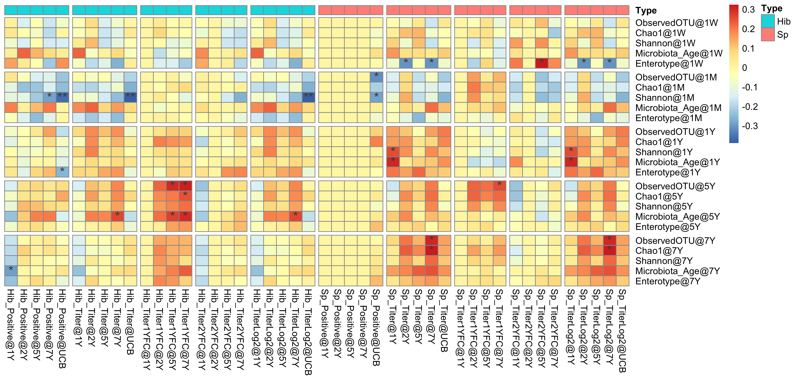

```{r ChunkOption, include = FALSE, warning = FALSE}
# chunk option
knitr::opts_chunk$set(echo = FALSE, # chunkを出力として表示するか否か
                      eval = FALSE, # chunkを実際にRのコードとして評価するか否か
                      warning = FALSE, # chunkに対する警告を表示させるか否か
                      message = FALSE, # chunkに対するエラーを表示させるか否か
                      comment = "", # 計算結果の頭につく文字
                      cache = FALSE ) 

Sys.setlocale("LC_ALL", 'UTF-8')
options(scipen = 10)
```


```{R}
# Packages
source("~/Git/Database/Common/Library_Basic.R" )
source("~/Git/Database/Common/Library_Bioinformatics.R")
source("~/Git/Database/Common/Function.R")
source("~/Git/Database/Common/Function_Mb.R")

# source("~/Git/Database/RIKENcohort/RIKENcohort_Function.R")
# source("~/Git/Database/RIKENcohort/RIKENcohort_Clinicaldata.R")
# source("~/Git/Database/RIKENcohort/RIKENcohort_Vaccine.R")
```

```{R}
Titer_tbl %>% 
   filter(Age != "UCB") %>% 
  inner_join(Vaccination_tbl %>% 
               spread(Age, Value) %>% 
               mutate(`5Y` = `2Y`,
                      `7Y` = `2Y`) %>% 
               select(-`6M`) %>% 
               gather(Age, Vaccination,
                      -SubjectID, -Variable)) %>% 
  mutate(Positive = if_else(Value >= 1, "1", "0")) %>% 
  c2f -> TitVac_tbw
```

# Basic analysis
## Sample number
```{R}
AbVacMb_tbw %>% 
  group_by(SubjectID, Variable, Age_Feces) %>% 
  summarise() %>% 
  group_by(Variable, Age_Feces) %>% 
  summarise(Count = n()) %>% 
  spread(Variable, Count) %>% 
  arrange(Age_Feces) %>% 
  table2png("Vaccine/Table_SampleNumber.png")
```


## LRTI
```{R}
LRTI_tbl %>% 
  group_by(Age, Value) %>% 
  summarise(Count = n()) %>% 
  ggplot(., aes(x = Age, y = Count, fill = Value))+
  geom_bar(stat = "identity")
ggsave("Vaccine/Barplot_Age_LRTI.png",
       dpi = 300, h = 2.5, w = 2.5)
```


## Vaccination
```{R}
Vaccination_tbl %>% 
  mutate(Value = as.factor(Value)) %>% 
  group_by(Age, Variable, Value) %>% 
  summarise(Count = n()) %>% 
  mutate(Age = fct_relevel_age(Age)) %>%
  
  ggplot(., aes(x = Age, y = Count, fill = Value))+
  geom_bar(stat = "identity",
           position = position_stack(reverse = TRUE))+
  facet_wrap(~ Variable)+
  scale_fill_brewer(palette = "blue")
ggsave("Vaccine/Barplot_Age_Vaccination.png",
       dpi = 300, h = 2.5, w = 4)
```


## Titer
```{R}
Titer_tbl %>% 
  ggplot(., aes(x = Age, y = Value, fill = Age))+
  geom_hline(yintercept = 1,
             color = "darkgray",
             linetype = "dashed")+
  geom_jitter(color = "gray")+
  geom_boxplot(alpha = 0.8, outlier.shape = NA)+
  facet_wrap(~ Variable, scale = "free_y")+
  scale_y_log10()
ggsave("Vaccine/Boxplot_Age_Titer.png",
       dpi = 300, h = 2.5 , w = 5)
```


## Positive
```{R}
Positive_tbl %>% 
  group_by(Variable, Age, Value) %>% 
  summarise(Count = n()) %>% 
  
  ggplot(., aes(x = Age, y = Count, fill = Value))+
  geom_bar(stat = "identity", position = "fill")+
  facet_wrap(~ Variable)
ggsave("Vaccine/Barplot_Age_Positive.png",
       dpi = 300, h = 2.5, w = 4)
```

# Relationship with titer
## Vaccination vs. Titer
```{R}
list(Vaccination = Vaccination_df,
     npMb = npMb_df,
     gutMb = gutMb_df) -> Exposure_df_list
```


```{R}
Exposure_df_list[[1]] -> df_ex

map(1:3, function(i){
    Exposure_df_list[[i]] -> df_ex
    
    intersect(rownames(Antibody_df),
              rownames(df_ex)) -> subjectid_mutual

associate_r(
            df_ex[subjectid_mutual, ],
            Antibody_df[subjectid_mutual, ],
            method = "spearman",
            p.adj.method = "none") %>% 
  make_list_pheatmap -> associate_list

associate_list$cor %>% 
  nrow -> nrow

list(c(3),
     c(0),
     c(5, 10, 15, 20)) -> gaps_col_list

pheatmap(associate_list$cor,
         display_numbers = associate_list$sd,
         fontsize_number = 14,
         #cutree_rows = 7,
         cluster_rows = FALSE,
         cluster_cols = FALSE,
         #cutree_cols = 5,
         gaps_col = c(5, 10, 14, 18, 23), 
         gaps_row = gaps_col_list[[i]],
         file = glue::glue("Vaccine/Heatmap_{names(Exposure_df_list)[i]}.png"),
         res = 300,
         h = 2 + nrow * 0.15, w = 8)
  })

```


## Nasopharyngeal Mb vs. Titer


## Gut microbiota vs. Titer


## Envfit: Genus
```{R}
set.seed(1202)
# list(Genus = Genus_tbl %>%
#        filter_mb(., 0.2),
#      OTU = OTU_tbl %>%
#        filter_mb(., 0.2)) -> gutMb_list

list(Genus = Genus_tbl ,
     OTU = OTU_tbl ) -> gutMb_list
```


```{R}
map(gutMb_list, function(tbl){
  
  tbl %>%
  spread(Variable, Value) %>%
  mutate(Age = droplevels(Age)) %>% 
  split(., .$Age) %>% 
  map(~ select(.x, -Age)) %>% 
  map(~ c2r(., "SubjectID")) -> list

  map(list, function(df){
  
  intersect(rownames(Antibody_df),
            rownames(df)) -> sampleid_mutual
  
  df[sampleid_mutual, ] %>% 
  as.matrix %>% 
  metaMDS(.,
        distance = "bray") -> nmds
  
  envfit(nmds,
       Antibody_df[sampleid_mutual, ],  
       permutations = 999,
       na.rm = TRUE)}) -> envfit_list
  
  map(1:length(envfit_list), function(i){
  envfit_list[[i]] -> envfit
  
  envfit %>% 
    .$vectors -> vectorfit
  
    data.frame(P.value = vectorfit$pvals,
               R2 = vectorfit$r,
               Age_Feces = names(Envfit_Genus_list)[i]) %>% 
      r2c("Variable")}) %>%
  do.call(bind_rows, .) %>% 
  mutate(Age_Feces = paste("Feces", Age_Feces, sep = "@")) %>% 
  mutate(Age_Feces = fct_relevel(Age_Feces,
                                 "Feces@1W"))}) -> list

list -> Envfit_Result_list
```


```{R}
map(1:2, function(i){
  Envfit_Result_list[[i]] -> tbw
  
  tbw %>% 
  #mutate(Variable = gsub("@.*", "", Variable)) %>% 
  #mutate(Variable = gsub("Nutritional:", "", Variable)) %>% 
  dplyr::select(-P.value) %>% 
  mutate(R2 = if_else(R2 == 0, 10^(-6), R2)) %>% 
  mutate(R2 = log(R2, 10)) %>% 
  spread(Variable, R2) %>% 
  c2r("Age_Feces") -> r2_df

  tbw %>% 
  dplyr::select(-R2) %>% 
  mutate(P.value = add_sd(P.value)) %>% 
  spread(Variable, P.value) %>% 
  c2r("Age_Feces") -> sd_df

sd_df[is.na(sd_df)] <- ""

pheatmap::pheatmap(r2_df,
                   display_numbers = sd_df, 
                   # annotation_col = Envfit_Category_df,
                   fontsize_number = 14,
                   file = glue::glue("Vaccine/Heatmap_Envfit_{names(Envfit_Result_list)[i]}.png"),
                   cutree_cols = 6,
                   na_col = "black",
                   angle_col = 90,
                   gaps_col = c(5, 10, 14, 19, 24), 
                   cluster_rows = FALSE,
                   cluster_cols = FALSE,
                   color = colorRampPalette(c("gray40",
                                    "ivory", "orangered"))(100),
                   res = 300, width= 6, height = 2.25)})
```


## Envfit: OTU


## Correlaiton genus vs titer
```{R}
map(1:length(Genus_list), function(i){
  Genus_list[[i]] -> df
  
  associate_r(df,
              df_ex,
              method = "spearman",
              p.adj.method = "none") %>% 
    make_list_pheatmap -> list
  
  list$sd %>% 
    r2c("Variable") %>% 
    gather(SD, Value, -Variable) %>% 
    filter(Value != "") %>% 
    group_by(Variable) %>% 
    summarise() %>% 
    .$Variable -> variable_sd
  
  variable_sd %>% 
    nchar %>% 
    max -> nchar_sd
  
  pheatmap(list$cor[variable_sd, ],
         display_numbers = list$sd[variable_sd, ],
         # annotation_row = Annotation_Row_df[, -1, drop = FALSE],
         fontsize_number = 14,
         # cutree_rows = 7,
         cluster_rows = FALSE,
         cluster_cols = FALSE,
         gaps_col = 5,
         file = glue::glue("Vaccine/Heatmap_Ab_Genus_{names(Genus_list)[i]}.png"),
         res = 300,
         h = 1+length(variable_sd)*0.18,
         w = 3+nchar_sd*0.06)})
```

