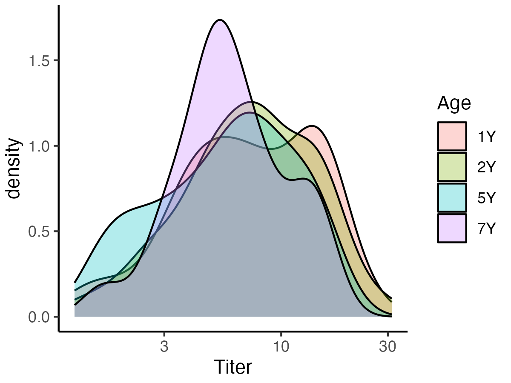

```{r ChunkOption, include = FALSE, warning = FALSE}
# chunk option
knitr::opts_chunk$set(echo = FALSE, # chunkを出力として表示するか否か
                      eval = FALSE, # chunkを実際にRのコードとして評価するか否か
                      warning = FALSE, # chunkに対する警告を表示させるか否か
                      message = FALSE, # chunkに対するエラーを表示させるか否か
                      comment = "", # 計算結果の頭につく文字
                      cache = FALSE ) 

Sys.setlocale("LC_ALL", 'UTF-8')
options(scipen = 10)

source("RIKENcohort-Vaccine_Setup.R")
```

# Aim0
## Cohorts
```{R}
Titer_tbl %>% 
  group_by(SubjectID) %>% 
  summarise() %>% 
  .$SubjectID -> SubjectID_Analysis

Dictionary_tbw %>% 
  .$Variable_R -> Clinicaldata_Dictionary

Clinicaldata_Analysis_tbw %>% 
  select(SubjectID, Clinicaldata_Dictionary)  -> tbw

Dictionary_tbw %>% 
  .$Variable_Table -> names(tbw)[-1] 

tbw %>% 
  mutate(Cohort = if_else(SubjectID %in% SubjectID_Analysis,
                          "Analytic cohort", "Non-analytic cohort")) %>% 
  c2f %>% 
  summarise_background(data = .,
                       omit = "SubjectID",
                       digits_con = 1,
                       digits_cat = 0,
                       show_levels = TRUE) %>% 
  filter(!grepl("-|CMC|Analytic cohort", Variables)) -> Cohort_Overall_tbw

tbw %>% 
  mutate(Cohort = if_else(SubjectID %in% SubjectID_Analysis,
                          "Analytic cohort", "Non-analytic cohort")) %>% 
  c2f %>% 
  compare_background(data = .,
                     group = "Cohort",
                     omit = "SubjectID",
                     digits_con = 1,
                     digits_cat = 0,
                     show_all = FALSE,
                     multi_level = c("Breastfeeding at 1W",
                                     "Breastfeeding at 1M",
                                     "Breastfeeding at 4M")) %>% 
  inner_join(Cohort_Overall_tbw, .) %>% 
  mutate(P.value = format_pvalue(P.value)) -> Cohort_RAW_table

Cohort_RAW_table %>% 
  mutate(Variable_Table = gsub("\\ \\[.*\\]", "", Variables)) %>% 
  inner_join(Dictionary_tbw) %>% 
  mutate(Variables = fct_reorder(Variables, Number)) %>% 
  arrange(Variables) %>% 
  select(-Number, -Variable_R, -Variable_Table) %>%
  mutate(Variables = gsub("\\ \\[\\+\\]|\\ \\[\\CUH\\]|\\ \\[\\Female\\]", "", Variables)) -> Cohort_table

sjPlot::tab_df(Cohort_table,
               col.header = names(Cohort_table),
               file = "Aim0/Table_Cohort.doc")

table2png(Cohort_table, "Aim0/Table_Cohort.png")
```


## Cohort, bacteria
```{R}

SkinNPMb_df %>% 
  r2c("SubjectID") %>%  
  mutate_if(is.numeric, funs(if_else(. > 0, "1", "0"))) %>% 
  filter(SubjectID %in% Clinicaldata_Analysis_tbw$SubjectID) %>% 
  c2f %>% 
  mutate(Dammy = 1) %>% 
  summarise_background(data = .,
                       omit = "SubjectID",
                       digits_con = 1,
                       digits_cat = 0,
                       show_levels = TRUE) %>% 
  filter(!grepl("-|0", Variables)) %>% 
  filter(!grepl("Dammy|Number", Variables)) -> Cohort_Bacteria_Overall_tbw

SkinNPMb_df %>% 
  r2c("SubjectID") %>% 
  mutate_if(is.numeric, funs(if_else(. > 0, "1", "0"))) %>% 
  filter(SubjectID %in% Clinicaldata_Analysis_tbw$SubjectID) %>% 
  mutate(Dammy = 1) %>% 
  mutate(Cohort = if_else(SubjectID %in% SubjectID_Analysis,
                          "Analytic cohort", "Non-analytic cohort")) %>% 
  c2f -> tbw
  compare_background(data = tbw,
                     group = "Cohort",
                     omit = "SubjectID",
                     digits_con = 1,
                     digits_cat = 0,
                     show_all = FALSE,
                     multi_level = c("Nasopharynx: Streptococcus pneumoniae@1M")) #%>% 
  inner_join(Cohort_Overall_tbw, .) %>% 
  mutate(P.value = format_pvalue(P.value)) -> Cohort_RAW_table

```

# Aim1
## Figure1A: pathplot
```{R}
Titer_tbl %>% 
  mutate(Age = fct_relevel(Age, "UCB")) %>% 
  
  filter(Age != "UCB") %>% 
  mutate(Variable = fct_recode(Variable,
                               "S. pneumoniae (U/mL)" = "Sp",
                               "H. influenzae type B (µg/mL)" = "Hib")) %>% 
  ggplot(., aes(x = Age, y = Value, fill = Age))+
  geom_line(color = "darkgray",
            aes(group = SubjectID))+
  geom_hline(yintercept = 1,
             color = "firebrick3",
             linetype = "dashed")+
  facet_wrap(~ Variable, scale = "free_y")+
  labs(y = "Titer")+
  theme(axis.title.x = element_blank(),
        axis.title.y = element_text(size = 10),
        axis.text = element_text(size = 10),
        strip.text = element_text(size = 10))+
  scale_y_log10()+
  theme(axis.title.x = element_blank())+
  geom_hline(yintercept = 1,
             linetype = "dashed",
             color = "firebrick4") -> Fig1A_gg

ggsave("Aim1/Figure1A.tiff",
       plot = Fig1A_gg,
       dpi = 300, h = 2.75 , w = 5.25)
```


## Density plot (Sp)
```{R}
Titer_tbl %>% 
  mutate(Age = fct_relevel(Age, "UCB")) %>% 
  filter(Age != "UCB") %>% 
  filter(Variable == "Sp") %>% 
  ggplot(., aes(x = Value, fill = Age))+
  geom_density(alpha = 0.3)+
  labs(x = "Titer")+
  scale_x_log10()
ggsave("Aim1/Densityplot_Sp.png",
       dpi = 300, h = 3, w = 4)
```


## Figure1B: alluvium plot, Hib
```{R}
Titer_tbl %>% 
  mutate(Value = log(Value, 2)) %>% 
  filter(Variable == "Hib") %>% 
  filter(Age != "UCB") %>% 
  mutate(Cutoff = log(1, 2)) %>% 
  mutate(Group = if_else(Value > Cutoff, "≥1.0", "<1.0")) %>%
  select(SubjectID, Age, Group) %>% 
  spread(Age, Group) %>% 
  group_by(`1Y`, `2Y`, `5Y`, `7Y`) -> Hib_Dichotomous_tbw

Hib_Dichotomous_tbw %>% 
  summarise(Count = n()) %>% 
  mutate_if(is.character, funs(fct_relevel(., "≥1.0"))) -> Hib_Alluvium_tbw
  
ggplot(Hib_Alluvium_tbw,
       aes(y = Count,
           axis1 = `1Y`,
           axis2 = `2Y`,
           axis3 = `5Y`,
           axis4 = `7Y`)) +
  geom_alluvium(aes(fill = `7Y`),
                width = 1/12) +
  geom_stratum(width = 2/12,
               fill = "white",
               color = "grey") +
  geom_label(stat = "stratum",
             size = 3.5,
             aes(label = after_stat(stratum))) +
  scale_x_discrete(limits = c("1Y", "2Y", "5Y", "7Y"),
                   expand = c(0.1, .05)) +
  #scale_fill_manual(values = Colors_Endotype[1:5])+
  theme(axis.text = element_text(size = 10),
        axis.title = element_text(size = 10),
        legend.text = element_text(size = 10),
        legend.title = element_text(size = 10))+
  labs(fill = "Long-term protective titer") +
  scale_fill_brewer(palette = "Set2",labels = c("+", "-")) -> Fig1B_gg
ggsave("Aim1/Figure1B.tiff",
       plot = Fig1B_gg,
       dpi = 300, h = 4, w = 5)
```


## Figure1
```{R}
ggpubr::ggarrange(plotlist = list(Fig1A_gg,
                                  Fig1B_gg),
                          labels = c("A.", "B."),
                  nrow = 2,
                  heights = c(0.85, 1),
                  widths = c(0.85, 1)) %>% 
ggsave("/Users/shibataryohei/Dropbox/Manuscript/RIKENcohort-Vaccine/Figure/Figure1.tiff",
       plot = .,
       dpi = 600, 
       h = 5.5, w = 5)
```


# Aim2
## Figure2, forest plot
```{R}
Vaccination_tbl %>% 
  mutate(Value = case_when(Age == "6M"&Value < 3|Age == "6M"&is.na(Value) ~ "-",
                           Age == "6M"&Value >= 3 ~ "+",
                           Age == "1Y"&Value < 3 ~ "-",
                           Age == "1Y"&Value >= 3 ~ "+",
                           Age == "2Y"&Value < 4 ~ "-",
                           Age == "2Y"&Value >= 3 ~ "+")) %>%
  filter(Variable == "Hib") %>% 
  mutate(Variable = case_when(Age == "6M" ~ "Vaccination 3 doses by 6M",
                              Age == "1Y" ~ "Vaccination 4 doses by 1Y",
                              Age == "2Y" ~ "Vaccination 4 doses by 2Y")) %>% 
  select(-Age) %>% 
               spread(Variable, Value) %>% 
  c2f  -> Vaccination_Dichotomous_tbw
```


```{R}
Clinicaldata_Analysis_tbw %>% 
  select(SubjectID, Sibling,
         matches("HBM|Pet|Daycare"), 
         Sex, Delivery, Gestation_Week, BirthBW, Mother_ABx, `ABx@1W`) %>%
  mutate_if(grepl("HBM", names(.)),
            funs(if_else(. %in% c("Exclusive or almost exclusive", "Exclusive"),
                         "EBF",
                    "Not EBF"))) %>% 
  mutate_if(grepl("HBM", names(.)),
            funs(fct_relevel(., "Not EBF"))) %>% 
  c2f %>% 
  inner_join(Hib_Dichotomous_tbw %>%
               ungroup %>% 
               select(SubjectID, `7Y`), .) %>% 
  c2f %>% 
  ungroup %>% 
  select(-`Daycare_Ever@6M`) %>% 
  mutate(`7Y` = if_else(`7Y` == "<1.0",
                        "1", "0")) %>% 
  inner_join(Vaccination_Dichotomous_tbw %>% 
               select(!matches("Sp|6M"))) %>% 
  mutate_all(funs(fct_relevel(., "-"))) %>% 
  mutate_all(funs(fct_relevel(., "Not EBF"))) %>% 
  mutate(Delivery = fct_relevel(Delivery, "VD")) %>% 
  mutate(Sex = fct_relevel(Sex, "Male")) %>% 
  c2f -> Clinicaldata_Hib_tbw 

Clinicaldata_Hib_tbw %>% summary
```

```{R}
Clinicaldata_Hib_tbw %>% 
  names %>% 
  .[-1:-2] %>% 
  .[!grepl("Siblings_Daycare|BirthBW|Gestational", .)]-> Exposures_Metadata

Exposures_Metadata[1] -> x

future_map(Exposures_Metadata, function(x){
  
  Clinicaldata_Hib_tbw %>% 
    .[, c("7Y", x)] -> tbw
  
  glue("`7Y` ~ `{x}`") %>% 
    as.formula -> formula
  
  glm(formula,
      family = binomial(link = "logit"),
      data = tbw) %>% 
    broom.mixed::tidy(.,
                      effects = "fixed",
                      conf.int = TRUE,
                      exponentiate = TRUE) %>% 
    filter(term != "(Intercept)")
}) %>% 
  do.call(bind_rows, .) -> res_tbw
```


```{R}
res_tbw %>% 
  tidy_table() %>% 
  inner_join(res_tbw %>% 
               rename(Variable = term) %>% 
               select(Variable, estimate, conf.low, conf.high)) %>% 
  rename(`Odds ratio` = Estimate,
         `P value` = `p-value`) %>% 
  mutate(Variable = gsub("`|EBF|\\+|CS|Female", "", Variable)) %>% 
  left_join(.,
            Dictionary_tbw %>% 
               rename(Variable = Variable_R)) %>% 
  mutate(Variable = if_else(grepl("doses", Variable),
                            Variable,
                            Variable_Table)) %>% 
  mutate(Number = case_when(Variable == "Vaccination 4 doses by 1Y" ~ 92,
                            Variable == "Vaccination 4 doses by 2Y" ~ 93,
                            Variable == "Vaccination 3 doses by 6M" ~ 91,
                            !grepl("Number of", Variable) ~ Number)) %>% 
  arrange(Number) %>% 
  select(-Number, -Variable_Table) %>%
  mutate(Variable = if_else(grepl("Breastfeeding", Variable),
                            gsub("Breastfeeding", "(Almost) exclusive breastfeeding", Variable),
                            paste(Variable))) %>% 
  filter(!grepl("Prematurity|Low|pregnancy", Variable)) %>% 
  rename(`Odds ratio (95% CI)` = `Odds ratio`) -> forest_tbw
```


```{R}

forest_tbw %>% 
  colnames %>% 
  data.frame(Variable = .) %>% 
  mutate(Value = NA) %>% 
  spread(Variable, Value) %>% 
  mutate_if(grepl("conf|estimate", names(.)), funs(as.numeric)) %>% 
  mutate_if(!grepl("conf|estimate", names(.)), funs(as.character)) -> blank_tbw

bind_rows(forest_tbw[1:4, ],
          
          blank_tbw %>% mutate(Variable = "(Almost) exclusive breastfeeding*"),
          forest_tbw[5:7, ] %>% 
            mutate(Variable = gsub("\\(Almost\\) exclusive breastfeeding", "    ", Variable)),
          
          blank_tbw %>% mutate(Variable = "Ever attended daycare"),
          forest_tbw[8:9, ] %>% 
            mutate(Variable = gsub("Ever attended daycare", "    ", Variable)),
          
           blank_tbw %>% mutate(Variable = "Presence of furry pet"),
          forest_tbw[10:14, ] %>% 
            mutate(Variable = gsub("Presence of furry pet", "    ", Variable)),
           blank_tbw %>% mutate(Variable = "Hib vaccination"),
           forest_tbw[15:16, ] %>%
            mutate(Variable = gsub("Vaccination", "    ", Variable))) -> forest_tbw
```

```{R}
list(Variable = c(list(expression(bold("Variable"))),
                     forest_tbw$Variable),
     
     `Odds ratio (95% CI)` = c(list(expression(bold("Odds ratio (95% CI)"))),
                               forest_tbw$`Odds ratio (95% CI)`),
     `P value` = c(list(expression(bold("P value"))),
                   forest_tbw$`P value`)) -> list
```

```{R}
library(extrafont)
library(forestplot)

tiff("/Users/shibataryohei/Dropbox/Manuscript/RIKENcohort-Vaccine/Figure/Figure2.tiff",
      height = 2600,
      width = 3600,
      res = 600)
forestplot::forestplot(labeltext = list,
           xticks =  c(log(0.02), log(0.1), 0, log(10), log(20)), # range of x axis
           xticks.digits = 0,
           
           xlab = expression(bold("Odds ratio (95% CI)")),
           
           hrzl_lines = list("2" = gpar(lwd = 1, # line (band) width
                        				    lineend = "butt", # shape of line end
                        				    col = "black")#,
                        #      "6" = gpar(lwd = 35, # line (band) width
                        # 				    lineend = "butt", # shape of line end
                        # 				    col = "#99999922"),
                        #      "9" = gpar(lwd = 35, # line (band) width
                        # 				    lineend = "butt", # shape of line e
                        # 				    col = "#99999922"),
                        #      "12" = gpar(lwd = 35, # line (band) width
                        # 				    lineend = "butt", # shape of line end
                        # 				    col = "#99999922")
                             ), # color
           
           txt_gp = fpTxtGp(label = # text setting 
                              list(gpar(cex = 0.8,
                                        fontfamily = "sans")),
                              ticks = gpar(cex = 0.8),
                              xlab = gpar(cex = 0.8),
                              title = gpar(cex = 1)),
           
           col = fpColors(lines = "black", # line of color 
                          zero = "gray50"),
           zero = 1,
           cex = 1.3,
           
           lineheight = unit(6,"mm"), # line interval
           graph.pos = 2, # col number of forest plot
           xlog = TRUE,
           boxsize = 0.30,
           colgap = unit(2, "mm"),
           lwd.zero = 1, # line strong
           ci.vertices = TRUE,
           ci.vertices.height = 0.2 ,
           mean = c(NA,  forest_tbw$estimate),
           lower = c(NA, forest_tbw$conf.low),
           upper = c(NA, forest_tbw$conf.high))
dev.off()
```


# Aim3
## Figure 3A: forest plot
```{R}
Alpha_tbl %>% 
  filter(Variable_Feces == "Shannon") %>% 
  mutate(Variable_Feces = fct_recode(Variable_Feces,
                                     "Gut: Shannon index" = "Shannon")) %>% 
  unite(Variable, Variable_Feces, Age_Feces, sep = " at ") %>% 
  spread(Variable, Value_Feces) -> Shannon_tbw

SkinNPMb_df %>% 
  r2c("SubjectID") %>% 
  select(-matches("Number")) %>% 
  mutate_if(is.numeric, funs(if_else(. > 0, "1", "0"))) %>% 
  c2f %>% 
  inner_join(Shannon_tbw) %>% 
  inner_join(LTPT_tbl %>% 
               mutate(LTPT = as.factor(LTPT)), .) -> Exposure_SkinNP_tbw
```


```{R}
Exposure_SkinNP_tbw %>% summary

Exposure_SkinNP_tbw %>% 
  # select(-matches("pneumoniae|influenz")) %>% 
  names %>% 
  .[-1:-2] -> Exposures_SkinNP


map(Exposures_SkinNP, function(x){
  
  Exposure_SkinNP_tbw %>% 
    .[, c("LTPT", x)] -> tbw
  
  glue("`LTPT` ~ `{x}`") %>% 
    as.formula -> formula
  
  if(grepl("Streptococcus", x)){
    
    logistf::logistf(formula,
                     data = tbw) -> fit
  
  data.frame(estimate = exp(fit$coefficients),
             conf.low = exp(fit$ci.lower),
             conf.high = exp(fit$ci.upper),
             p.value = fit$prob) %>% 
  r2c("term") %>% 
  filter(!grepl("Intercept", term))
    
  }else if(grepl("Haemophilus", x)){
    data.frame(term = glue("`{x}`1"),
               estimate = NA,
             conf.low = NA,
             conf.high = NA,
             p.value = NA) 
  }else{
  
  glm(formula,
      family = binomial(link = "logit"),
      data = tbw) %>% 
    broom::tidy(.,
                      conf.int = TRUE,
                      exponentiate = TRUE) %>% 
    filter(term != "(Intercept)") %>% 
      select(term, estimate, conf.low, conf.high, p.value)}
}) %>% 
  do.call(bind_rows, .) -> res_tbw
```


```{R}
res_tbw %>% 
  mutate(std.error = NA,
         statistic = NA) %>% 
  tidy_table() %>% 
  inner_join(res_tbw %>% 
               # rename(Variable = term) %>% 
               select(term, estimate, conf.low, conf.high)) %>% 
  rename(Variable = term,
         `Odds ratio` = Estimate,
         `P value` = `p.value`) %>% 
  mutate(Variable = gsub("`|`1", "", Variable)) %>% 
  mutate(Variable = gsub("@", " at ", Variable)) %>% 
  rename(`Odds ratio (95% CI)` = `Odds ratio`) %>% 
  .[c(5:6,  1:4, 8, 7, 9:11), ] -> forest_tbw

data.frame(Variable = c("Skin", "Nasopharynx", "Gut"),
           P.value = NA,
           `Odds ratio (95% CI)` = c("", "", ""),
           estimate = NA,
           conf.low = NA,
           conf.high = NA) -> Blank_tbw

names(Blank_tbw)[3] <- "Odds ratio (95% CI)"

bind_rows(Blank_tbw[1, ],
          forest_tbw[1:2, ] %>% 
            mutate(Variable = gsub("Skin: ", "    ", Variable)),
          Blank_tbw[2, ],
          forest_tbw[3:6, ] %>% 
            mutate(Variable = gsub("Nasopharynx: ", "    ", Variable)),
          Blank_tbw[3, ],
          forest_tbw[7:11, ] %>% 
            mutate(Variable = gsub("Gut: ", "    ", Variable))) -> forest_tbw

forest_tbw[5, c(3, 7)] <- "—"

forest_tbw[5, 1] <- "    Haemophilus influenzae at 1M*"
forest_tbw[8, 1] <- "    Streptococcus pneumoniae at 1M†"
```


```{R}
list(Variable = c(list(expression(bold("Variable"))),
                     forest_tbw$Variable),
     `Odds ratio (95% CI)` = c(list(expression(bold("Odds ratio (95% CI)"))),
                               forest_tbw$`Odds ratio (95% CI)`),
     `P value` = c(list(expression(bold("P value"))),
                   forest_tbw$`P value`)) -> list
```

```{R}
library(extrafont)
library(forestplot)

tiff("/Users/shibataryohei/Dropbox/Manuscript/RIKENcohort-Vaccine/Figure/Figure3.tiff",
      height = 2000,
      width = 3600,
      res = 600)
forestplot::forestplot(labeltext = list,
           xticks =  c(log(0.05), log(0.1), 0, log(10), log(20)), # range of x axis
           xticks.digits = 0,
           
           xlab = expression(bold("Odds ratio (95% CI)")),
           
           hrzl_lines = list("2" = gpar(lwd = 1, # line (band) width
                        				    lineend = "butt", # shape of line end
                        				    col = "black")), # color
           clip = c(0.05, Inf),
           txt_gp = forestplot::fpTxtGp(label = # text setting 
                              list(gpar(cex = 0.8,
                                        fontfamily = "sans")),
                              ticks = gpar(cex = 0.8),
                              xlab = gpar(cex = 0.8),
                              title = gpar(cex = 1)),
           
           col = forestplot::fpColors(lines = "black", # line of color 
                          zero = "gray50"),
           zero = 1,
           cex = 1.3,
           
           lineheight = unit(6,"mm"), # line interval
           graph.pos = 2, # col number of forest plot
           xlog = TRUE,
           boxsize = 0.30,
           colgap = unit(2, "mm"),
           lwd.zero = 1, # line strong
           ci.vertices = TRUE,
           ci.vertices.height = 0.2 ,
           mean = c(NA,  forest_tbw$estimate),
           lower = c(NA, forest_tbw$conf.low),
           upper = c(NA, forest_tbw$conf.high))
dev.off()
```


## Figure 3B: Adonis
```{R}
OTU_tbl %>%
  mutate(Age = droplevels(Age)) %>% 
  split(., .$Age) %>% 
  map(~ .x %>% 
        select(-Age) %>% 
        spread(Variable, Value) %>% 
        c2r("SubjectID")) -> OTU_df_list

OTU_df_list %>% 
  map(~ vegan::vegdist(.x, 
                 method = "bray")) -> OTU_dist_list
```

```{R}
map(OTU_dist_list,
    ~ ape::pcoa(.x,
          correction = "lingoes", # Correction methods for negative eigenvalues
          # lingoes, cailliez, none
          rn = NULL)) -> OTU_pcoa_list

OTU_pcoa_list %>% 
  map(~ .x %>% 
        .$values %>% 
        #.$Relative_eig %>% 
        .$Rel_corr_eig %>% 
      as.numeric) -> Contribution_list
```

```{R}
pmap(list(OTU_pcoa_list,
          Contribution_list,
          names(Contribution_list)),
     function(pcoa, v, data){
       pcoa1 = sprintf("%.1f", v[1]*100)
       pcoa2 = sprintf("%.1f", v[2]*100)
       
  pcoa %>% 
        .$vectors %>%
    as.data.frame %>% 
    tibble::rownames_to_column(., "SubjectID") %>% 
  .[, 1:3] %>% 
  rename(Axis1 = Axis.1,
         Axis2 = Axis.2) %>% 
  mutate(Data = data) %>% 
    c2f %>% 
    inner_join(LTPT_tbl) %>% 
  ggplot(., aes(x = Axis1, y = Axis2, fill = LTPT))+
  geom_point(pch = 21,
             alpha = 0.8,
             size = 1)+
  theme(legend.key.size = unit(3, "mm")) +
         xlab(glue("PCoA1 ({pcoa1}%)"))+
    ylab(glue("PCoA2 ({pcoa2}%)"))+
    stat_ellipse(aes(color = LTPT),
                 linetype = "dashed")+
    guides(fill = FALSE)+
    guides(color = FALSE)
  }) -> OTU_PCoA_gg_list

ggpubr::ggarrange(plotlist = OTU_PCoA_gg_list,
                  labels = names(OTU_PCoA_gg_list),
                  hjust = -0.65,
                  # vjust = -1,
                  # heights = c(1, 1, 1),
                  # widths = c(1, 1, 1),
                  nrow = 1) %>% 
  ggsave("Aim3/PCoA_LTPT.png",
       plot = .,
       dpi = 600,
       h = 2.4, w = 11.5)
```

```{R}
OTU_dist_list %>% 
  imap(., function(dist, age){
    
    vegan::adonis2(dist ~ LTPT,
              permutations = 999,
              method = "euclidean",
              data = LTPT_tbl %>% 
                c2r("SubjectID") %>% 
                .[attr(dist, "Labels"), ,
                  drop = FALSE]
                  ) %>%
  as.data.frame %>%
  r2c("Variable") %>% 
      mutate(Age = age)}) -> Adonis_LTPT_tbw_list

Adonis_LTPT_tbw_list %>% 
  do.call(bind_rows, .) %>% 
  filter(Variable == "LTPT")

```

```{R}
map(Age_Analysis, function(age){
Genus_tbl %>% 
    filter(Age %in% age) %>% 
    select(-Age) %>% 
    filter_mb(., 0.15) %>% 
  inner_join(LTPT_tbl) %>% 
  spread(Variable, Value) %>%
  gather(Variable, Value, -SubjectID) %>%
  ungroup %>%
  mutate(Variable = fct_relevel(Variable, "LTPT")) %>%
  spread(SubjectID, Value) %>%
    write.table(glue("Aim3/Table_LTPT_{age}.txt"),
                col.names = FALSE,
                row.names = FALSE,
                quote = FALSE,
                sep = "\t")})

```

## Figure 3C: LEfSe
```{R}
Genus_tbl %>% 
  mutate(Age = droplevels(Age)) %>% 
  split(., .$Age) %>% 
  map(~ .x %>% 
        select(-Age)) -> Genus_tbl_list

Genus_tbl_list %>% 
  imap(~ .x %>% 
        inner_join(LTPT_tbl) %>%
         filter_mb(., 0.15) %>% 
  spread(Variable, Value) %>%
  gather(Variable, Value, -SubjectID) %>%
  ungroup %>%
  mutate(Variable = fct_relevel(Variable, "LTPT")) %>%
  spread(SubjectID, Value) %>%
    write.table(glue("Aim3/Table_Genus_LTPT_{.y}.txt"),
                col.names = FALSE,
                row.names = FALSE,
                quote = FALSE,
                sep="\t"))
```


```{R}
Ages <- c("1W", "1M", "1Y", "5Y", "7Y")

map(Ages, function(age){
  read_delim(glue("/Users/shibataryohei/Dropbox/Database/RIKENcohort/Vaccine/LEfSe_{age}.lefse_internal_res"),
           col_names = FALSE) %>% 
  rename(Variable = X1,
                      LDA = X2,
                      LTPT = X3,
                      adj.LDA = X4,
                      P.value = X5) %>%
        dplyr::select(Variable, LDA, LTPT, P.value) %>% 
    mutate(Age = age)}) %>% 
  do.call(bind_rows, .) -> tbw

tbw %>% 
  filter(!is.na(LTPT)) %>% 
  .$Variable %>% 
  as.factor %>% 
  levels -> var_sd

Genus_tbl %>% 
  inner_join(LTPT_tbl) %>% 
  mutate(Age = droplevels(Age)) %>% 
  split(., .$Age) -> Genus_tbl_list

Genus_tbl_list %>% 
  map(~ .x %>% 
        filter_mb(., 0.25) %>% 
        .$Variable %>% 
        droplevels %>% 
        levels %>% 
        length)

Genus_tbl_list %>% 
  map(~ .x %>% 
        filter_mb(., 0.25) %>% 
        group_by(Variable, Age) %>% 
        wilcox_test(Value ~ LTPT) %>% 
        mutate(FDR = qvalue_r(p))) -> tbw

tbw %>% 
  do.call(bind_rows, .) %>% 
  filter(p < 0.05) %>% 
  select(Variable, Age) -> Genus_Wilcox_SD_tbw

Genus_tbl %>% 
  inner_join(Genus_Wilcox_SD_tbw) %>% 
    inner_join(LTPT_tbl) %>% 
  unite(Variable, Variable, Age, sep = "@") %>% 
    ggplot(., aes(x = LTPT, y = Value))+
  # geom_jitter()+
  # geom_boxplot(alpha = 0.8, outlier.shape = NA)+
  
  geom_boxplot(alpha = 0.8,
             color = "darkgray",
             size = 0.25,
             outlier.shape = NA)+
  ggbeeswarm::geom_quasirandom(size = 1,
                               pch = 21,
                               aes(fill = LTPT))+
  facet_wrap(~ Variable, scale = "free", nrow = 2)
```


```{R}
tbw %>% 
  filter(Variable %in% var_sd) %>% 
  mutate(P.value = as.numeric(P.value)) %>% 
  select(Variable, P.value, Age) %>% 
  mutate(P.value = add_sd(P.value)) %>% 
  spread(Age, P.value) %>% 
  c2r("Variable") %>% 
  select(`1W`, everything()) -> SD_df

tbw %>% 
  filter(Variable %in% var_sd) %>% 
  select(Variable, LDA, Age) %>% 
  spread(Age, LDA) %>% 
  c2r("Variable") %>% 
  select(`1W`, everything()) -> LDA_df


```

## Lasso
```{R}
library(caret)
library(tidyverse)

Hib_Dichotomous_tbw %>% 
  ungroup %>% 
  select(SubjectID, `7Y`) %>%
  mutate(`7Y` = if_else(`7Y` == "≥1.0", "Yes", "No")) %>% 
  mutate_all(as.factor) %>% 
  rename(LTPT = `7Y`) -> LTPT_tbl

map(Age_Analysis, function(age){
Genus_tbl %>% 
  filter(Age == age) %>% 
  check_levels("SubjectID") %>% 
  intersect(., SubjectID_Analysis) -> subjectID_analysis_feces

Genus_tbl %>% 
  filter(Age == age) %>% 
  filter(SubjectID %in% subjectID_analysis_feces) %>% 
  filter_mb(., 0.2) %>% 
  mutate(Value = Value/3) %>% 
  spread(Variable, Value) %>% 
  select(-Age) %>% 
  inner_join(LTPT_tbl) %>% 
  c2r("SubjectID") %>% 
  as.data.frame -> genus_lasso_df

myTrainingControl <- trainControl(method = "LOOCV", 
                                  returnResamp = "all",
                                  savePredictions = TRUE, 
                                  classProbs = TRUE,
                                  summaryFunction = twoClassSummary,
                                  preProcOptions = NULL)
# Grid
train_grid.lasso <- expand.grid(alpha  = 1, # 1, lasso; 0, ridge
                                lambda = seq(0, 1, by = 0.01)) # 0.001

fit_lasso <- caret::train(LTPT ~ .,  
                          data   = genus_lasso_df, 
                          method = "glmnet", 
                          metric = "ROC",  
                          tuneGrid  = train_grid.lasso,
                          trControl = myTrainingControl)

# Decide model to evaluate
model_lasso_final <- fit_lasso 

# Function get best result 
model_lasso_final$bestTune %>% 
  rownames -> best_n

model_lasso_final$results %>% 
  .[best_n, ] %>% 
  as.data.frame -> best_result

best_result$lambda -> best_lambda

# Result of best parameter1
model_lasso_final$finalModel %>% 
  coef(., s = best_lambda) %>% 
  exp -> lasso_full.or

# Result of best parameter
coef(model_lasso_final$finalModel,
     model_lasso_final$bestTune$lambda) %>% 
  as.matrix %>% 
  as.data.frame %>% 
  r2c("Variable") %>% 
  filter(!grepl("ntercept", Variable)) %>% 
  rename(Coef = s1) %>% 
  filter(Coef != 0) %>% 
  filter(!grepl("Intercept", Variable)) %>% 
  .$Variable -> variable_lasso

genus_lasso_df %>% 
  .[, c(variable_lasso, "LTPT")] -> genus_lasso2_df

# Bootstrap
set.seed(1202)
furrr::future_map(1:2000, function(i){
  
  sample(x = 1:nrow(genus_lasso2_df), 
          size = nrow(genus_lasso2_df), # 21
          replace = T) -> boot_rows
  
  genus_lasso2_df %>% 
    .[boot_rows, ] -> genus_lasso_bootstrap_df
  
  boot.lasso_full <- caret::train(LTPT ~ .,  
                            data   = genus_lasso_bootstrap_df, 
                            method = "glmnet", 
                            metric = "ROC",  
                            tuneGrid  = expand.grid(lambda = best_lambda,
                                                    alpha = 0),
                            trControl = myTrainingControl)
  
  coef(boot.lasso_full$finalModel,
       s = best_lambda) %>% 
    as.matrix %>% 
    as.data.frame %>% 
    r2c("Variable") %>% 
    filter(!grepl("Intercept", Variable)) %>% 
    mutate(Simulation = i) %>% 
    rename(coef = s1)}) -> list

list %>% 
  do.call(bind_rows, .) %>% 
  group_by(Variable) %>% 
  summarise(OR = exp(quantile(coef, 0.5, na.rm = T)),
            lowCI = exp(quantile(coef, 0.025, na.rm = T)),
            upCI = exp(quantile(coef, 0.975, na.rm = T)))}) -> res_tbw_list

names(res_tbw_list) <- Age_Analysis

imap(res_tbw_list, ~ write_csv(.x, glue("/Users/shibataryohei/Dropbox/Database/RIKENcohort/CSV/Lasso_{.y}.csv")))

map(res_tbw_list, ~ .x %>% 
      filter(OR < 1 & upCI < 1|OR > 1 & lowCI > 1))
```


```{R}
map(Age_Analysis, function(age){
Genus_tbl %>% 
  filter(Age == age) %>% 
  check_levels("SubjectID") %>% 
  intersect(., SubjectID_Analysis) -> subjectID_analysis_feces

Genus_tbl %>% 
  filter(Age == age) %>% 
  filter(SubjectID %in% subjectID_analysis_feces) %>% 
  filter_mb(., 0.2) %>% 
  inner_join(LTPT_tbl) %>% 
  group_bye
```


```{R}
res_tbw -> Lasso_1W_tbw

map(res_tbw_list, function(tbw){
  tbw %>% 
  filter(OR > 1&lowCI>1|OR <= 1&upCI<=1)
})


write_csv(Lasso_1W_tbw, "CSV/Lasso_1W.csv")
```


## coda4microbiome
```{R}
install.packages("coda4microbiome")

library(coda4microbiome)
data(Crohn,
     package = "coda4microbiome")
coda_glmnet(x_Crohn[,(1:10)],y_Crohn,showPlots= FALSE) -> res

res %>% names

res[[4]]
```

```{R}
Hib_Dichotomous_tbw %>% 
  ungroup %>% 
  select(SubjectID, `7Y`) %>%
  mutate(`7Y` = if_else(`7Y` == "≥1.0", "Yes", "No")) %>% 
  mutate_all(as.factor) %>% 
  rename(LTPT = `7Y`) -> LTPT_tbl

set.seed(1)

map(Age_Analysis, function(age){
Genus_tbl %>% 
  filter(Age == age) %>% 
  check_levels("SubjectID") %>% 
  intersect(., SubjectID_Analysis) -> subjectID_analysis_feces

Genus_tbl %>% 
  filter(Age == age) %>% 
  filter(SubjectID %in% subjectID_analysis_feces) %>% 
  filter_mb(., 0.2) %>% 
  # mutate(Value = Value/30) %>% 
  spread(Variable, Value) %>% 
  select(-Age) %>% 
  inner_join(LTPT_tbl, .) %>% 
  c2r("SubjectID") %>% 
  as.data.frame -> df

coda_glmnet(df[, -1],
            df[, 1],
            showPlots = FALSE)}) -> res_list

names(res_list) <- Age_Analysis
map(res_list, ~ .x[[2]])
```


# Aim4
```{R}
# No Feces SA == 1 and skinNP SA == 0
Hib_LR_SkinNP_tbw %>% 
  select(SubjectID, matches("aureus@1M"), `7Y`) %>% 
  inner_join(GutMb_Species_CR_tbw %>% 
               select(SubjectID, matches("aureus@1M")) %>% 
               mutate(`Feces: Staphylococcus aureus@1M` =
                        if_else(`Feces: Staphylococcus aureus@1M`>0, "1", "0"))) %>% 
  mutate(`Staphylococcus aureus@1M` = 
           if_else(`Nasopharynx: Staphylococcus aureus@1M` == "1"|
                     `Skin: Staphylococcus aureus@1M` == "1",
                   "1", "0")) %>% 
  inner_join(Metadata_tbw %>%
               select(SubjectID, Sibling, Sex, `HBM@1M`)) -> Hib_LR_SA_tbw


Hib_LR_SA_tbw %>% 
  select(matches("@")) %>% 
  names -> Variable_SA
```

```{R}
map(Variable_SA, function(x){
  as.formula(glue("`7Y` ~ `{x}`")) -> formula
  
  glm(formula,
      family = "binomial"(link = "logit"),
      data = Hib_LR_SA_tbw) %>% 
   broom.mixed::tidy(.,
                      effects = "fixed",
                      conf.int = TRUE,
                      exponentiate = TRUE) %>% 
      filter(grepl("Staphylococcus", term)) %>% 
    mutate(Model = "Unadjusted") -> unadjusted_tbw
  
  as.formula(glue("`7Y` ~ `{x}` + Sibling + Sex")) -> formula
  
  glm(formula,
      family = "binomial"(link = "logit"),
      data = Hib_LR_SA_tbw) %>% 
   broom.mixed::tidy(.,
                      effects = "fixed",
                      conf.int = TRUE,
                      exponentiate = TRUE) %>% 
      filter(grepl("Staphylococcus", term)) %>% 
    mutate(Model = "Adjusted*") -> adjusted_tbw
  
  bind_rows(unadjusted_tbw,
            adjusted_tbw)
  }) %>% 
  do.call(bind_rows, .) -> res_tbw

res_tbw %>% 
  tidy_table() %>% 
  inner_join(res_tbw %>% 
               rename(Variable = term) %>% 
               select(Variable, estimate, conf.low, conf.high, Model)) %>% 
  mutate(Variable = gsub("`Staphylococcus aureus@1M`1", "Any site", Variable)) %>% 
  mutate(Variable = gsub("`|\\:\\ Staphylococcus aureus@1M`1", "", Variable)) %>% 
  .[c(3,4,1,2,7,8,5,6), c(1,3,4,2, 5,6,7)] %>% 
  mutate(Variable = if_else(Model == "Adjusted*", "", Variable)) -> forest_tbw
```

```{R}
list(Variable = c(list(expression(bold("Site"))),
                     forest_tbw$Variable),
     Model = c(list(expression(bold("Model"))),
                     forest_tbw$Model),
     `Odds ratio (95% CI)` = c(list(expression(bold("Odds ratio (95% CI)"))),
                               forest_tbw$Estimate),
     `P value` = c(list(expression(bold("P value"))),
                   forest_tbw$`p-value`)) -> forest_list
```

## Figure4, forest plot
```{R}
library(extrafont)
library(forestplot)

tiff("/Users/shibataryohei/Dropbox/Manuscript/RIKENcohort-Vaccine/Figure/Figure4.tiff",
      height = 1700,
      width = 3200,
      res = 600)
forestplot::forestplot(labeltext = forest_list,
           xticks =  c(log(0.5), 0, log(10), log(20)), # range of x axis
           xticks.digits = 0,
           
           xlab = expression(bold("Odds ratio (95% CI)")),
           
           hrzl_lines = list("2" = gpar(lwd = 1, # line (band) width
                        				    lineend = "butt", # shape of line end
                        				    col = "black"),#,
                             "5" = gpar(lwd = 35, # line (band) width
                        				    lineend = "butt", # shape of line e
                        				    col = "#99999922"),
                             "9" = gpar(lwd = 35, # line (band) width
                        				    lineend = "butt", # shape of line end
                        				    col = "#99999922")
                             ), # color
           
           txt_gp = fpTxtGp(label = # text setting 
                              list(gpar(cex = 0.8,
                                        fontfamily = "sans")),
                              ticks = gpar(cex = 0.8),
                              xlab = gpar(cex = 0.8),
                              title = gpar(cex = 1)),
           
           col = fpColors(lines = "black", # line of color 
                          zero = "gray50"),
           zero = 1,
           cex = 1.3,
           
           lineheight = unit(6,"mm"), # line interval
           graph.pos = 3, # col number of forest plot
           xlog = TRUE,
           boxsize = 0.30,
           colgap = unit(2, "mm"),
           lwd.zero = 1, # line strong
           ci.vertices = TRUE,
           ci.vertices.height = 0.2 ,
           mean = c(NA,  forest_tbw$estimate),
           lower = c(NA, forest_tbw$conf.low),
           upper = c(NA, forest_tbw$conf.high))
dev.off()
```
