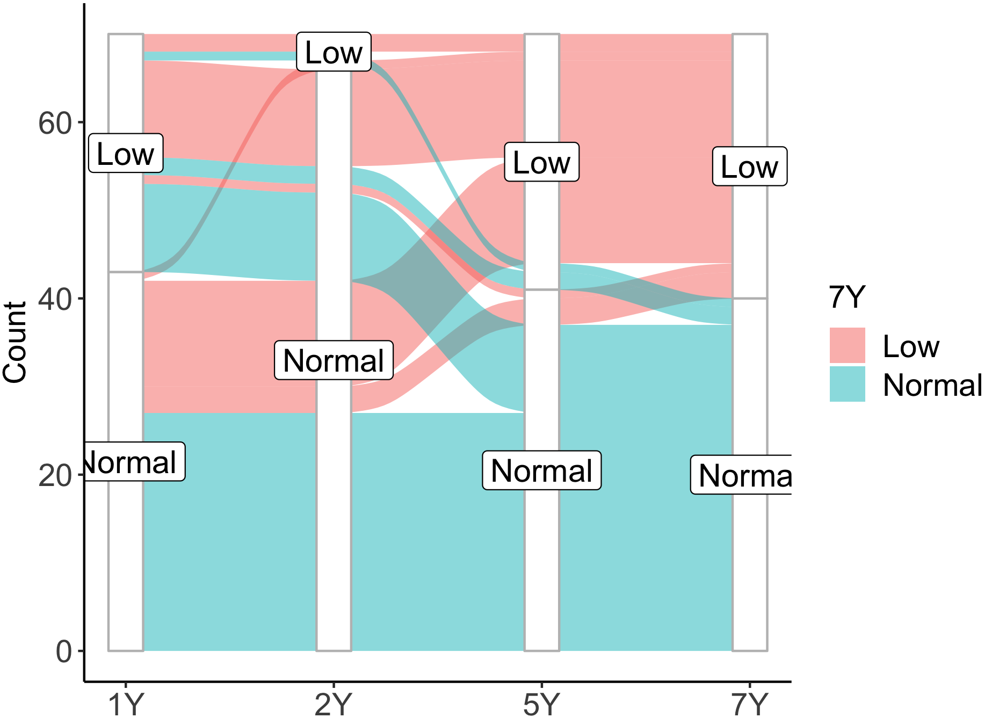
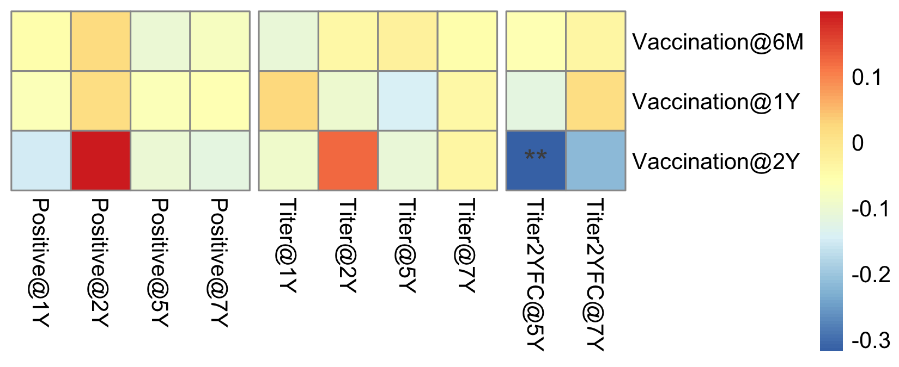

```{r ChunkOption, include = FALSE, warning = FALSE}
# chunk option
knitr::opts_chunk$set(echo = FALSE, # chunkを出力として表示するか否か
                      eval = FALSE, # chunkを実際にRのコードとして評価するか否か
                      warning = FALSE, # chunkに対する警告を表示させるか否か
                      message = FALSE, # chunkに対するエラーを表示させるか否か
                      comment = "", # 計算結果の頭につく文字
                      cache = FALSE ) 

Sys.setlocale("LC_ALL", 'UTF-8')
options(scipen = 10)
```


```{R}
source("RIKENcohort-Vaccine_Setup.R")
```

```{R}
Titer_tbl %>% 
  group_by(SubjectID) %>% 
  summarise() %>% 
  .$SubjectID -> SubjectID_Analysis

Dictionary_tbw %>% 
  .$Variable_R -> Clinicaldata_Dictionary

Clinicaldata_tbw %>% 
  
  select(SubjectID, Clinicaldata_Dictionary) %>% 
  mutate(Gestation_Week = if_else(Gestation_Week < 37, "+", "-")) %>% 
  mutate(BirthBW = if_else(BirthBW < 2500, "+", "-")) %>% 
  mutate(Hospital = fct_relevel(Hospital, "CUH")) %>% 
  c2f %>% 
  mutate_if(is.factor, fct_relevel_plus) %>% 
  mutate_if(is.factor, fct_relevel_hbm) %>% 
    mutate(Sibling = as.factor(Sibling)) -> tbw

Dictionary_tbw %>% 
  .$Variable_Table -> names(tbw)[-1] 

tbw %>% 
  mutate(Cohort = if_else(SubjectID %in% SubjectID_Analysis,
                          "Analytic cohort", "Non-analytic cohort")) %>% 
  c2f %>% 
  summarise_background(data = .,
                       omit = "SubjectID",
                       digits_con = 1,
                       digits_cat = 0,
                       show_levels = TRUE) %>% 
  filter(!grepl("-|CMC|Analytic cohort", Variables)) -> Cohort_Overall_tbw

tbw %>% 
  mutate(Cohort = if_else(SubjectID %in% SubjectID_Analysis,
                          "Analytic cohort", "Non-analytic cohort")) %>% 
  c2f %>% 
  compare_background(data = .,
                     group = "Cohort",
                     omit = "SubjectID",
                     digits_con = 1,
                     digits_cat = 0,
                     show_all = FALSE,
                     multi_level = c("The number of older siblings",
                                     "Breastfeeding at 1W",
                                     "Breastfeeding at 1M",
                                     "Breastfeeding at 4M")) %>% 
  inner_join(Cohort_Overall_tbw, .) %>% 
  mutate(P.value = format_pvalue(P.value)) -> Cohort_RAW_table

Cohort_RAW_table %>% 
  mutate(Variable_Table = gsub("\\ \\[.*\\]", "", Variables)) %>% 
  inner_join(Dictionary_tbw) %>% 
  mutate(Variables = fct_reorder(Variables, Number)) %>% 
  arrange(Variables) %>% 
  select(-Number, -Variable_R, -Variable_Table) %>%
  mutate(Variables = gsub("\\ \\[\\+\\]|\\ \\[\\CUH\\]|\\ \\[\\Female\\]", "", Variables)) -> Cohort_table

sjPlot::tab_df(Cohort_table,
               col.header = names(Cohort_table),
               file = "Aim0/Table_Cohort.doc")

```

```{R}
Titer_tbl %>% 
   filter(Age != "UCB") %>% 
  inner_join(Vaccination_tbl %>% 
               spread(Age, Value) %>% 
               mutate(`5Y` = `2Y`,
                      `7Y` = `2Y`) %>% 
               select(-`6M`) %>% 
               gather(Age, Vaccination,
                      -SubjectID, -Variable)) %>% 
  mutate(Positive = if_else(Value >= 1, "1", "0")) %>% 
  c2f -> TitVac_tbw
```


## Figure: pathplot
```{R}
Titer_tbl %>% 
  mutate(Age = fct_relevel(Age, "UCB")) %>% 
  
  filter(Age != "UCB") %>% 
  mutate(Variable = fct_recode(Variable,
                               "S.pneumoniae (U/mL)" = "Sp",
                               "H.influenzae type B (µg/mL)" = "Hib")) %>% 
  ggplot(., aes(x = Age, y = Value, fill = Age))+
  geom_line(color = "darkgray",
            aes(group = SubjectID))+
  geom_hline(yintercept = 1,
             color = "firebrick3",
             linetype = "dashed")+
  facet_wrap(~ Variable, scale = "free_y")+
  labs(y = "Titer")+
  theme(axis.title.x = element_blank(),
        axis.title.y = element_text(size = 10),
        axis.text = element_text(size = 10),
        strip.text = element_text(size = 10))+
  scale_y_log10()+
  theme(axis.title.x = element_blank())+
  geom_hline(yintercept = 1,
             linetype = "dashed",
             color = "firebrick4") -> Fig1A_gg

ggsave("Aim1/Figure1A.tiff",
       plot = Fig1A_gg,
       dpi = 300, h = 2.75 , w = 5.25)
```


## Density plot (Sp)
```{R}
Titer_tbl %>% 
  mutate(Age = fct_relevel(Age, "UCB")) %>% 
  filter(Age != "UCB") %>% 
  filter(Variable == "Sp") %>% 
  ggplot(., aes(x = Value, fill = Age))+
  geom_density(alpha = 0.3)+
  labs(x = "Titer")+
  scale_x_log10()
ggsave("Aim1/Densityplot_Sp.png",
       dpi = 300, h = 3, w = 4)
```


## Path plot (Sp)
```{R}
TiterFC2Y_tbl %>% 
  mutate(Value = log(Value, 2)) %>% 
  filter(Variable == "Sp") %>% 
  ggplot(., aes(x = Age, y = Value, group = SubjectID))+
  geom_path()+
  labs(y = "Log2 fold change of titer")
ggsave("Aim1/Pathplot_Sp.png",
       dpi = 300,
       h = 3, w = 3)
```


## Figure: alluvium plot, Hib
```{R}
Titer_tbl %>% 
  mutate(Value = log(Value, 2)) %>% 
  filter(Variable == "Hib") %>% 
  filter(Age != "UCB") %>% 
  mutate(Cutoff = log(1, 2)) %>% 
  mutate(Group = if_else(Value > Cutoff, "Normal", "Low")) %>%
  select(SubjectID, Age, Group) %>% 
  spread(Age, Group) %>% 
  group_by(`1Y`, `2Y`, `5Y`, `7Y`) -> Hib_Dichotomous_tbw

Hib_Dichotomous_tbw %>% 
  summarise(Count = n()) %>% 
  mutate_if(is.character, funs(fct_relevel(., "High"))) -> Hib_Alluvium_tbw
  
ggplot(Hib_Alluvium_tbw,
       aes(y = Count,
           axis1 = `1Y`,
           axis2 = `2Y`,
           axis3 = `5Y`,
           axis4 = `7Y`)) +
  geom_alluvium(aes(fill = `7Y`),
                width = 1/12) +
  geom_stratum(width = 2/12,
               fill = "white",
               color = "grey") +
  geom_label(stat = "stratum",
             size = 4,
             aes(label = after_stat(stratum))) +
  scale_x_discrete(limits = c("1Y", "2Y", "5Y", "7Y"),
                   expand = c(0.1, .05)) +
  #scale_fill_manual(values = Colors_Endotype[1:5])+
  theme(axis.text = element_text(size = 10),
        axis.title = element_text(size = 10),
        legend.text = element_text(size = 10),
        legend.title = element_text(size = 10))+
  labs(fill = "Hib titer\nat 7Y") -> Fig1B_gg
ggsave("Aim1/Figure1B.tiff",
       plot = Fig1B_gg,
       dpi = 300, h = 4, w = 6)
```


## Figure 1
```{R}
ggpubr::ggarrange(plotlist = list(Fig1A_gg,
                                  Fig1B_gg),
                          labels = c("A.", "B."),
                  nrow = 2,
                  heights = c(0.75, 1),
                  widths = c(0.75, 1)) %>% 
ggsave("Aim1/Figure1.tiff",
       plot = .,
       dpi = 600, 
       h = 6, w = 5)
```

## Figure: #vaccination vs. antibody
```{R}
Vaccination_df %>% 
  .[, grepl("Hib", names(.))] %>% 
  setNames(gsub("Hib_", "", names(.))) %>% 
  .[, c(3, 1, 2)] -> vaccination_df

Antibody_df %>% 
  .[, grepl("Hib", names(.))] %>% 
  .[, grepl("Positive|Titer@|Titer2YFC@", names(.))] %>% 
  .[, !grepl("Titer2YFC@1Y|Titer2YFC@2Y|UCB" ,names(.))] %>% 
  setNames(gsub("Hib_", "", names(.))) -> antibody_df

associate_r(vaccination_df,
            antibody_df,
            method = "spearman",
            p.adj.threshold = 1,
            p.adj.method = "none") %>% 
  make_list_pheatmap -> list

pheatmap(list$cor,
         display_numbers = list$sd,
         #annotation_col = annotation_col,
         fontsize_number = 14,
         #cutree_rows = 7,
         cluster_rows = FALSE,
         cluster_cols = FALSE,
         #cutree_cols = 5,
         gaps_col = c(4, 8), 
         file = glue::glue("Aim1/Heatmap_Vaccination_Hib.png"),
         res = 600,
         h = 2.25, w = 5.5)
```


## Figure: #vaccination vs. antibody
```{R}
Vaccination_df %>% 
  .[, grepl("Sp", names(.))] %>% 
  setNames(gsub("Sp_", "", names(.))) %>% 
  .[, c(3, 1, 2)] -> vaccination_df

Antibody_df %>% 
  .[, grepl("Sp", names(.))] %>% 
  .[, grepl("Titer@|Titer2YFC@", names(.))] %>% 
  .[, !grepl("Titer2YFC@1Y|Titer2YFC@2Y|UCB" ,names(.))] %>% 
  setNames(gsub("Sp_", "", names(.))) -> antibody_df

associate_r(vaccination_df,
            antibody_df,
            method = "spearman",
            p.adj.threshold = 1,
            p.adj.method = "none") %>% 
  make_list_pheatmap -> list

pheatmap(list$cor,
         display_numbers = list$sd,
         #annotation_col = annotation_col,
         fontsize_number = 14,
         #cutree_rows = 7,
         cluster_rows = FALSE,
         cluster_cols = FALSE,
         #cutree_cols = 5,
         gaps_col = c(4), 
         file = glue::glue("Aim1/Heatmap_Vaccination_Sp.png"),
         res = 600,
         h = 2.25, w = 4.5)
```


