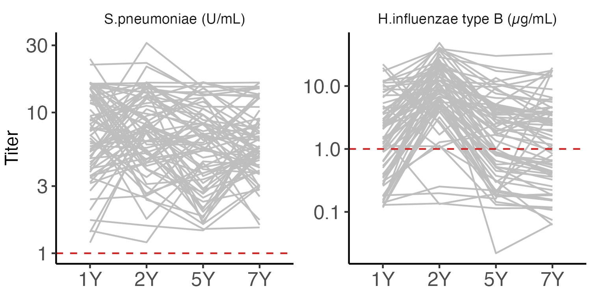

```{r ChunkOption, include = FALSE, warning = FALSE}
# chunk option
knitr::opts_chunk$set(echo = FALSE, # chunkを出力として表示するか否か
                      eval = FALSE, # chunkを実際にRのコードとして評価するか否か
                      warning = FALSE, # chunkに対する警告を表示させるか否か
                      message = FALSE, # chunkに対するエラーを表示させるか否か
                      comment = "", # 計算結果の頭につく文字
                      cache = FALSE ) 

Sys.setlocale("LC_ALL", 'UTF-8')
options(scipen = 10)
```


```{R}
# Packages
source("~/Git/Database/Library/Library_Basic.R" )
source("~/Git/Database/Library/Library_Bioinformatics.R")
source("~/Git/Database/Function/Function.R")
source("~/Git/Database/Function/Function_GE.R")

# source("~/Git/Database/RIKENcohort/RIKENcohort_Function.R")
# source("~/Git/Database/RIKENcohort/RIKENcohort_Clinicaldata.R")
# source("~/Git/Database/RIKENcohort/RIKENcohort_Vaccine.R")
```

```{R}
Titer_tbl %>% 
   filter(Age != "UCB") %>% 
  inner_join(Vaccination_tbl %>% 
               spread(Age, Value) %>% 
               mutate(`5Y` = `2Y`,
                      `7Y` = `2Y`) %>% 
               select(-`6M`) %>% 
               gather(Age, Vaccination,
                      -SubjectID, -Variable)) %>% 
  mutate(Positive = if_else(Value >= 1, "1", "0")) %>% 
  c2f -> TitVac_tbw
```


## Figure: pathplot
```{R}
Titer_tbl %>% 
  mutate(Age = fct_relevel(Age, "UCB")) %>% 
  filter(Age != "UCB") %>% 
  ggplot(., aes(x = Age, y = Value, fill = Age))+
  # geom_hline(yintercept = 1,
  #            color = "darkgray",
  #            linetype = "dashed")+
  geom_line(color = "gray",
            aes(group = SubjectID))+
  # geom_boxplot(alpha = 0.8, outlier.shape = NA)+
  facet_wrap(~ Variable, scale = "free_y")+
  scale_y_log10()+
  labs(y = "Titer")+
  theme(axis.title.x = element_blank())
ggsave("Aim1/Pathplot_Age_Titer.png",
       dpi = 300, h = 2.5 , w = 5)
```


## Figure: alluvium plot, Hib
```{R}
Titer_tbl %>% 
  mutate(Value = log(Value, 2)) %>% 
  filter(Variable == "Hib") %>% 
  filter(Age != "UCB") %>% 
  mutate(Cutoff = log(1, 2)) %>% 
  mutate(Group = if_else(Value > Cutoff, "Normal", "Low")) %>%
  select(SubjectID, Age, Group) %>% 
  spread(Age, Group) %>% 
  group_by(`1Y`, `2Y`, `5Y`, `7Y`) -> Hib_Dichotomous_tbw

names(Hib_Dichotomous_tbw)[2:5] <- 

Hib_Dichotomous_tbw %>% 
  summarise(Count = n()) %>% 
  mutate_if(is.character, funs(fct_relevel(., "High"))) -> Hib_Alluvium_tbw
  
ggplot(Hib_Alluvium_tbw,
       aes(y = Count,
           axis1 = `1Y`,
           axis2 = `2Y`,
           axis3 = `5Y`,
           axis4 = `7Y`)) +
  geom_alluvium(aes(fill = `7Y`),
                width = 1/12) +
  geom_stratum(width = 2/12,
               fill = "white",
               color = "grey") +
  geom_label(stat = "stratum",
             size = 5,
             aes(label = after_stat(stratum))) +
  scale_x_discrete(limits = c("1Y", "2Y", "5Y", "7Y"),
                   expand = c(.05, .05)) +
  #scale_fill_manual(values = Colors_Endotype[1:5])+
  theme(axis.text = element_text(size = 14),
        axis.title = element_text(size = 14),
        legend.text = element_text(size = 14),
        legend.title = element_text(size = 14))
ggsave("Aim1/Alluvium_Cluster.png",
       dpi = 300, h = 4.5, w = 6.2)
```


## Figure: #vaccination vs. antibody
```{R}
Vaccination_df %>% 
  .[, grepl("Hib", names(.))] %>% 
  setNames(gsub("Hib_", "", names(.))) %>% 
  .[, c(3, 1, 2)] -> vaccination_df

Antibody_df %>% 
  .[, grepl("Hib", names(.))] %>% 
  .[, grepl("Positive|Titer@|Titer2YFC@", names(.))] %>% 
  .[, !grepl("Titer2YFC@1Y|Titer2YFC@2Y|UCB" ,names(.))] %>% 
  setNames(gsub("Hib_", "", names(.))) -> antibody_df

associate_r(vaccination_df,
            antibody_df,
            method = "spearman",
            p.adj.threshold = 1,
            p.adj.method = "none") %>% 
  make_list_pheatmap -> list

pheatmap(list$cor,
         display_numbers = list$sd,
         #annotation_col = annotation_col,
         fontsize_number = 14,
         #cutree_rows = 7,
         cluster_rows = FALSE,
         cluster_cols = FALSE,
         #cutree_cols = 5,
         gaps_col = c(4, 8), 
         file = glue::glue("Aim1/Heatmap_Vaccination_Hib.png"),
         res = 600,
         h = 2.25, w = 5.5)
```


## Figure: #vaccination vs. antibody
```{R}
Vaccination_df %>% 
  .[, grepl("Sp", names(.))] %>% 
  setNames(gsub("Sp_", "", names(.))) %>% 
  .[, c(3, 1, 2)] -> vaccination_df

Antibody_df %>% 
  .[, grepl("Sp", names(.))] %>% 
  .[, grepl("Titer@|Titer2YFC@", names(.))] %>% 
  .[, !grepl("Titer2YFC@1Y|Titer2YFC@2Y|UCB" ,names(.))] %>% 
  setNames(gsub("Sp_", "", names(.))) -> antibody_df

associate_r(vaccination_df,
            antibody_df,
            method = "spearman",
            p.adj.threshold = 1,
            p.adj.method = "none") %>% 
  make_list_pheatmap -> list

pheatmap(list$cor,
         display_numbers = list$sd,
         #annotation_col = annotation_col,
         fontsize_number = 14,
         #cutree_rows = 7,
         cluster_rows = FALSE,
         cluster_cols = FALSE,
         #cutree_cols = 5,
         gaps_col = c(4), 
         file = glue::glue("Aim1/Heatmap_Vaccination_Sp.png"),
         res = 600,
         h = 2.25, w = 4.5)
```
