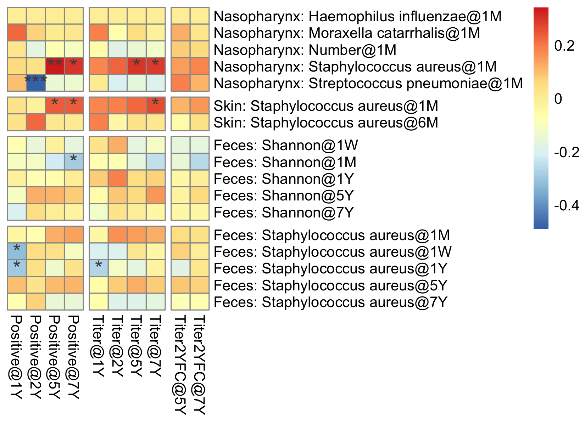
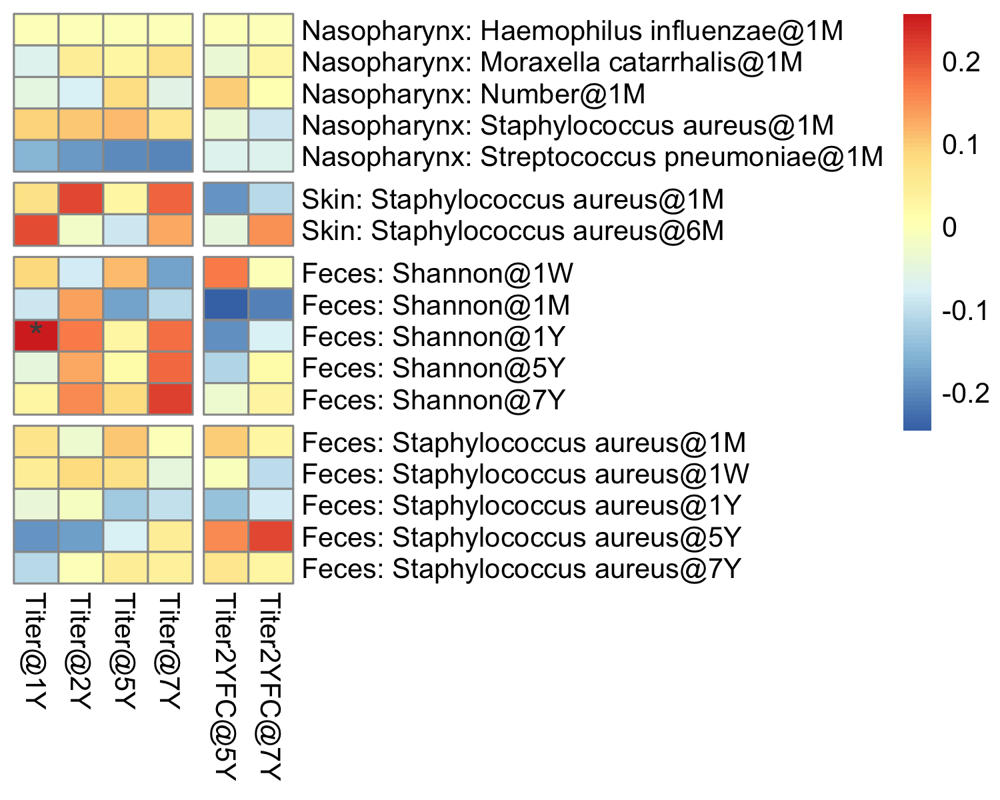
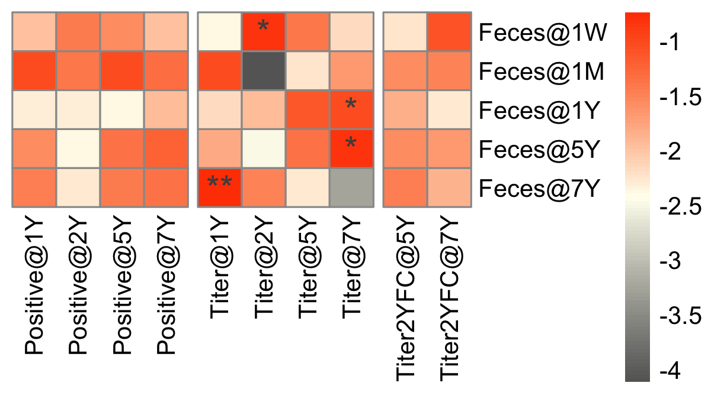
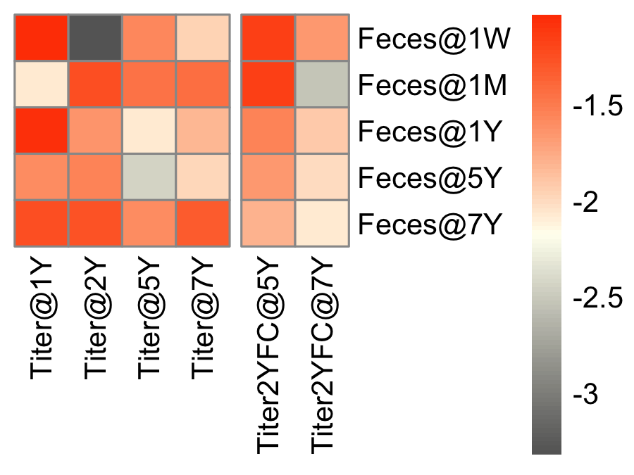
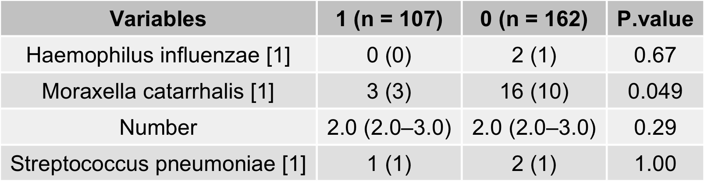

```{r ChunkOption, include = FALSE, warning = FALSE}
# chunk option
knitr::opts_chunk$set(echo = FALSE, # chunkを出力として表示するか否か
                      eval = FALSE, # chunkを実際にRのコードとして評価するか否か
                      warning = FALSE, # chunkに対する警告を表示させるか否か
                      message = FALSE, # chunkに対するエラーを表示させるか否か
                      comment = "", # 計算結果の頭につく文字
                      cache = FALSE ) 

Sys.setlocale("LC_ALL", 'UTF-8')
options(scipen = 10)
```


```{R}
source("RIKENcohort-Vaccine_Setup.R")
```

# Relationship of microbes with Ab

## Microbe data vs. Ab (Hib)
```{R}
SkinNPMb_df %>% 
  r2c("SubjectID") %>% 
  full_join(GutMb_df %>% 
                   .[, grepl("Shannon", names(.))] %>% 
              r2c("SubjectID") ) %>% 
  full_join(Species_CR_df %>% 
                   .[, grepl("Staphylococcus", names(.))] %>% 
              r2c("SubjectID") 
            ) %>% 
  c2r("SubjectID") %>% 
  setNames(gsub("Shannon", "Feces: Shannon", names(.))) %>% 
  mutate_all(as.numeric) -> exposure_df
```

```{R}
Antibody_df %>% 
  .[, grepl("Hib", names(.))] %>% 
  .[, grepl("Positive|Titer@|Titer2YFC@", names(.))] %>% 
  .[, !grepl("Titer2YFC@1Y|Titer2YFC@2Y|UCB" ,names(.))] %>% 
  setNames(gsub("Hib_", "", names(.))) -> antibody_df

associate_r(exposure_df,
            antibody_df,
            method = "spearman",
            p.adj.threshold = 1,
            p.adj.method = "none") %>% 
  make_list_pheatmap -> list

pheatmap(list$cor,
         display_numbers = list$sd,
         #annotation_col = annotation_col,
         fontsize_number = 14,
         #cutree_rows = 7,
         cluster_rows = FALSE,
         cluster_cols = FALSE,
         #cutree_cols = 5,
         gaps_col = c(4, 8), 
         gaps_row = c(5, 7, 12), 
         file = glue::glue("Aim3/Heatmap_Microbes_Hib.png"),
         res = 600,
         h = 4, w = 5.5)
```


## Microbe data vs. Ab (Sp)
```{R}
Antibody_df %>% 
  .[, grepl("Sp", names(.))] %>% 
  .[, grepl("Titer@|Titer2YFC@", names(.))] %>% 
  .[, !grepl("Titer2YFC@1Y|Titer2YFC@2Y|UCB" ,names(.))] %>% 
  setNames(gsub("Sp_", "", names(.))) -> antibody_df

associate_r(exposure_df,
            antibody_df,
            method = "spearman",
            p.adj.threshold = 1,
            p.adj.method = "none") %>% 
  make_list_pheatmap -> list

pheatmap(list$cor,
         display_numbers = list$sd,
         #annotation_col = annotation_col,
         fontsize_number = 14,
         #cutree_rows = 7,
         cluster_rows = FALSE,
         cluster_cols = FALSE,
         #cutree_cols = 5,
         gaps_col = c(4), 
         gaps_row = c(5, 7, 12), 
         file = glue::glue("Aim3/Heatmap_Microbes_Sp.png"),
         res = 600,
         h = 4, w = 5)
```


## OTU-level-gut-mb vs. Ab (Hib)

```{R}
set.seed(1202)
# list(Genus = Genus_tbl %>%
#        filter_mb(., 0.2),
#      OTU = OTU_tbl %>%
#        filter_mb(., 0.2)) -> GutMb_list

list(Genus = Genus_tbl ,
     OTU = OTU_tbl ) -> GutMb_list
```


```{R}
future_map(GutMb_list, function(tbl){
  
  tbl %>%
  spread(Variable, Value) %>%
  mutate(Age = droplevels(Age)) %>% 
  split(., .$Age) %>% 
  map(~ select(.x, -Age)) %>% 
  map(~ c2r(., "SubjectID")) -> list

  map(list, function(df){
  
  intersect(rownames(Antibody_df),
            rownames(df)) -> sampleid_mutual
  
  df[sampleid_mutual, ] %>% 
  as.matrix %>% 
  metaMDS(.,
        distance = "bray") -> nmds
  
  envfit(nmds,
       Antibody_df[sampleid_mutual, ],  
       permutations = 999,
       na.rm = TRUE)}) -> envfit_list
  
  map(1:length(envfit_list), function(i){
  envfit_list[[i]] -> envfit
  
  envfit %>% 
    .$vectors -> vectorfit
  
    data.frame(P.value = vectorfit$pvals,
               R2 = vectorfit$r,
               Age_Feces = names(Envfit_Genus_list)[i]) %>% 
      r2c("Variable")}) %>%
  do.call(bind_rows, .) %>% 
  mutate(Age_Feces = paste("Feces", Age_Feces, sep = "@")) %>% 
  mutate(Age_Feces = fct_relevel(Age_Feces,
                                 "Feces@1W"))}) ->  Envfit_Result_list
```


```{R}
Envfit_Result_list[["OTU"]] %>% 
  filter(grepl("Hib", Variable)) %>% 
  filter(!grepl("UCB", Variable)) %>% 
  filter(!grepl("UCB", Variable)) %>% 
  filter(grepl("Positive|Titer@|2YFC", Variable)) %>% 
  filter(!grepl("2YFC@1Y|2YFC@2Y", Variable)) %>% 
  mutate(Variable = gsub("Hib_", "", Variable)) -> tbw

tbw %>% 
  #mutate(Variable = gsub("@.*", "", Variable)) %>% 
  #mutate(Variable = gsub("Nutritional:", "", Variable)) %>% 
  dplyr::select(-P.value) %>% 
  mutate(R2 = if_else(R2 == 0, 10^(-6), R2)) %>% 
  mutate(R2 = log(R2, 10)) %>% 
  spread(Variable, R2) %>% 
  c2r("Age_Feces") -> r2_df

tbw %>% 
  dplyr::select(-R2) %>% 
  #mutate(P.value = qvalue_r(P.value)) %>% 
  mutate(P.value = add_sd(P.value)) %>% 
  spread(Variable, P.value) %>% 
  c2r("Age_Feces") -> sd_df

sd_df[is.na(sd_df)] <- ""

pheatmap::pheatmap(r2_df,
                   display_numbers = sd_df, 
                   # annotation_col = Envfit_Category_df,
                   fontsize_number = 14,
                   file = glue::glue("Aim3/Heatmap_Envfit_OTU_Hib.png"),
                   cutree_cols = 6,
                   na_col = "black",
                   angle_col = 90,
                   gaps_col = c(4, 8), 
                   cluster_rows = FALSE,
                   cluster_cols = FALSE,
                   color = colorRampPalette(c("gray40",
                                    "ivory", "orangered"))(100),
                   res = 300, width = 4, height = 2.25)
```


## OTU-level-gut-mb vs. Ab (Sp)

```{R}
Envfit_Result_list[["OTU"]] %>% 
  filter(grepl("Sp", Variable)) %>% 
  filter(!grepl("UCB", Variable)) %>% 
  filter(!grepl("UCB", Variable)) %>% 
  filter(grepl("Titer@|2YFC", Variable)) %>% 
  filter(!grepl("2YFC@1Y|2YFC@2Y", Variable)) %>% 
  mutate(Variable = gsub("Sp_", "", Variable)) -> tbw

tbw %>% 
  #mutate(Variable = gsub("@.*", "", Variable)) %>% 
  #mutate(Variable = gsub("Nutritional:", "", Variable)) %>% 
  dplyr::select(-P.value) %>% 
  mutate(R2 = if_else(R2 == 0, 10^(-6), R2)) %>% 
  mutate(R2 = log(R2, 10)) %>% 
  spread(Variable, R2) %>% 
  c2r("Age_Feces") -> r2_df

tbw %>% 
  dplyr::select(-R2) %>% 
  #mutate(P.value = qvalue_r(P.value)) %>% 
  mutate(P.value = add_sd(P.value)) %>% 
  spread(Variable, P.value) %>% 
  c2r("Age_Feces") -> sd_df

sd_df[is.na(sd_df)] <- ""

pheatmap::pheatmap(r2_df,
                   display_numbers = sd_df, 
                   # annotation_col = Envfit_Category_df,
                   fontsize_number = 14,
                   file = glue::glue("Aim3/Heatmap_Envfit_OTU_Sp.png"),
                   cutree_cols = 6,
                   na_col = "black",
                   angle_col = 90,
                   gaps_col = c(4), 
                   cluster_rows = FALSE,
                   cluster_cols = FALSE,
                   color = colorRampPalette(c("gray40",
                                    "ivory", "orangered"))(100),
                   res = 300, width = 3, height = 2.25)
```


## Relative abundance in OTU level vs. Ab
No significantly correlated OTU-level gut microbiota.

# Staphylococcus
```{R}
NPMb_tbw %>% 
  mutate_if(is.factor, funs(fct_relevel(., "1"))) %>% 
  compare_background(.,
                     group = "Staphylococcus aureus",
                     omit = "SubjectID",
                     digits_con = 1,
                     digits_cat = 0,
                     show_all = FALSE) %>% 
  mutate(P.value = format_pvalue(P.value)) %>% 
  table2png("Aim3/Table_SA_NpMb.png")
```



# Lasso
```{R}
Hib_Dichotomous_tbw %>% 
               ungroup %>% 
               select(SubjectID, `7Y`) %>%
  mutate(`7Y` = if_else(`7Y` == "≥1.0", , 0)) %>% 
  rename(LTPT = `7Y`) -> LTPT_tbl

#Lipid_Species_Norm_df %>% 
Genus_tbl %>% 
  filter(Age == "1W") %>% 
  filter_mb(., 0.1) %>% 
  spread(Variable, Value) %>% 
  select(-Age) %>% 
  inner_join(LTPT_tbl, .) %>%
  c2r("SubjectID") %>% 
  mutate_all(as.numeric) %>% 
  as.matrix -> Genus_Lasso_mx

set.seed(1202)

glmnet::cv.glmnet(x = Genus_Lasso_mx[, -1],
          y = as.factor(Genus_Lasso_mx[, 1]),
       alpha = 1, # α = 0, Ridge; 0 < α < 1, Elastic Net
       family = "binomial") -> Lasso_cv

png("Aim3/Point_Lambda_Error.png",
    res = 300, h = 1200, w = 1000)
plot(Lasso_cv)
dev.off()
```


```{R}
# Fit the final model on the training data
glmnet::cv.glmnet(x = Genus_Lasso_mx[, -1],
          y = as.factor(Genus_Lasso_mx[, 1]),
       alpha = 1, # α = 0, Ridge; 0 < α < 1, Elastic Net
       family = "binomial") -> Lasso_All_cv

glmnet::glmnet(Genus_Lasso_mx[, -1],
        as.factor(Genus_Lasso_mx[, 1]),
        #Asthma,
        alpha = 1, # 1, lasso; 0, ridge
        family = "binomial",
        lambda = Lasso_All_cv$lambda.min # lambda.min or  lambda.1se
        ) -> Lasso_All_lasso # Lasso_2vsOthers_cv$lambda.1se


coef(Lasso_All_lasso) %>%
  as.matrix %>% 
  as.data.frame %>% 
  filter(s0 != 0) %>% 
  r2c("Genus") %>% 
  arrange(desc(abs(s0))) -> Lasso_Result_tbw

Lasso_Result_tbw %>% 
  filter(!grepl("Intercept", Genus)) %>% 
  .$Genus -> Genus_Hib

Lasso_Result_tbw %>% 
  table2png("Aim3/Table_Predictor.png")
```


```{R}
Genus_tbl %>% 
  filter(Variable %in% Genus_Hib) %>% 
  inner_join(LTPT_tbl) %>% 
  group_by(Variable) %>% 
  rstatix::wilcox_test(Value ~ LTPT) %>% 
  arrange(p) %>% 
  filter(p < 0.05) %>% 
  .$Variable -> sd1

Genus_tbl %>% 
  filter(Variable %in% sd1) %>% 
  inner_join(LTPT_tbl) %>% 
  #mutate(Fungitype = if_else(Fungitype == "2", 
  #                           "2", "0+1")) %>% 
  ggplot(., aes(x = as.factor(LTPT), y = Value, color = LTPT))+
  ggbeeswarm::geom_quasirandom(size = 0.5)+
  geom_boxplot(alpha = 0, color = "darkgray", size = 0.25)+
  facet_wrap(~ Variable, scale = "free", nrow = 1) +
  labs(y = "Concentration") +
  guides(color = FALSE)
ggsave("Aim3/Beeswarm_LTPT_Genus.png",
       dpi = 300, h = 4.5, w = 7.5)
```


```{R}
Lipid_Species_tbl %>% 
  filter(Variable %in% Lipid_Species_CPAPintubate) %>% 
  spread(Variable, Value) %>% 
  c2r("study_id") -> Lipid_Species_Lasso_df
```