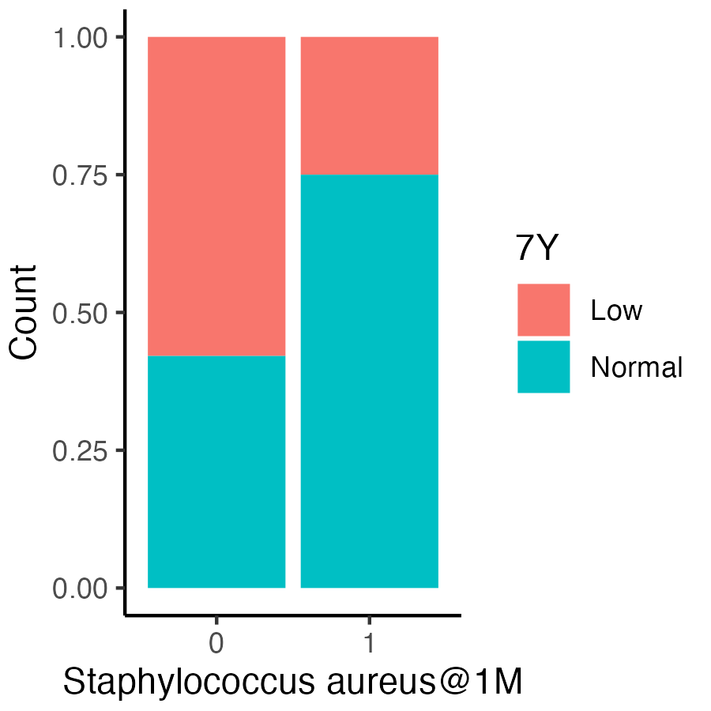
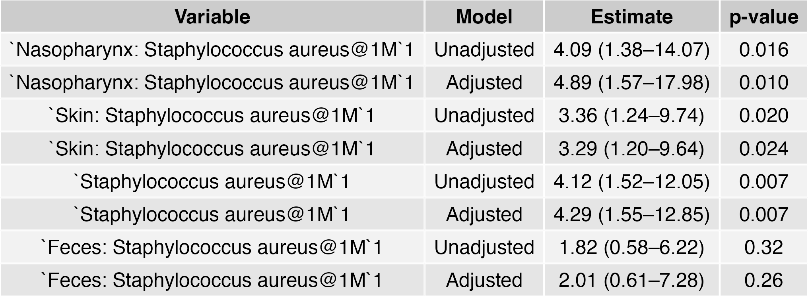

```{r ChunkOption, include = FALSE, warning = FALSE}
# chunk option
knitr::opts_chunk$set(echo = FALSE, # chunkを出力として表示するか否か
                      eval = FALSE, # chunkを実際にRのコードとして評価するか否か
                      warning = FALSE, # chunkに対する警告を表示させるか否か
                      message = FALSE, # chunkに対するエラーを表示させるか否か
                      comment = "", # 計算結果の頭につく文字
                      cache = FALSE ) 

Sys.setlocale("LC_ALL", 'UTF-8')
options(scipen = 10)
```


```{R}
# Packages
source("~/Git/Database/Library/Library_Basic.R" )
source("~/Git/Database/Library/Library_Bioinformatics.R")
source("~/Git/Database/Function/Function.R")
source("~/Git/Database/Function/Function_GE.R")

# source("~/Git/Database/RIKENcohort/RIKENcohort_Function.R")
# source("~/Git/Database/RIKENcohort/RIKENcohort_Clinicaldata.R")
# source("~/Git/Database/RIKENcohort/RIKENcohort_Vaccine.R")
```

# Sp: titer at 7Y

# Hib: titer at 7Y


# Hib: low at 7Y
## Association of #vaccination

```{R}
Vaccination_tbl %>% 
  filter(Variable == "Hib") %>% 
  unite_var %>% 
  spread(Variable, Value) %>% 
  inner_join(Hib_Dichotomous_tbw) %>% 
  c2f -> Hib_LR_tbw

Age_Ab <- c("1Y", "2Y", "5Y", "7Y")


map(Age_Ab, function(i){
  map(c("Hib@6M", "Hib@1Y", "Hib@2Y"), function(x){
  
  as.formula(glue("`{i}` ~ `{x}`")) -> formula
  glm(formula,
      family = "binomial"(link = "logit"),
      data = Hib_LR_tbw) %>% 
   broom.mixed::tidy(.,
                      effects = "fixed",
                      conf.int = TRUE,
                      exponentiate = TRUE) %>% 
      filter(!grepl("Intercept", term)) %>% 
      mutate(Age = i)
    
  })}) %>% 
  do.call(bind_rows, .) %>% 
  tidy_table(.) %>% 
  unite(Estimate, Estimate, `p-value`, sep = ", p = ") %>% 
  spread(Age, Estimate) %>% 
  table2png("Aim4/Table_Dichotomous_Vaccination.png")
```


## Colonization of S.aureus at 1M
```{R}
SkinNPMb_df %>% 
  r2c("SubjectID") %>% 
  inner_join(Hib_Dichotomous_tbw) %>% 
  select(-`Nasopharynx: Haemophilus influenzae@1M`) %>% 
  mutate_if(grepl("Skin", names(.)), 
            funs(if_else(. > 0, "1", "0"))) %>% 
  mutate(`Staphylococcus aureus@1M` =
           if_else(`Nasopharynx: Staphylococcus aureus@1M` == "1"|
                     `Skin: Staphylococcus aureus@1M` == "1",
         "1", "0")) %>% 
  c2f -> Hib_LR_SkinNP_tbw 

Hib_LR_SkinNP_tbw %>% 
  select(matches("@")) %>% 
  names -> Variable_SkinNP

map(Variable_SkinNP, function(x){
  
  as.formula(glue("`7Y` ~ `{x}`")) -> formula
  
  glm(formula,
      family = "binomial"(link = "logit"),
      data = Hib_LR_SkinNP_tbw) %>% 
   broom.mixed::tidy(.,
                      effects = "fixed",
                      conf.int = TRUE,
                      exponentiate = TRUE) %>% 
      filter(!grepl("Intercept", term))
  }) %>% 
  do.call(bind_rows, .) %>% 
  tidy_table(.) 

Hib_LR_SkinNP_tbw %>% 
  group_by(`7Y`, `Staphylococcus aureus@1M`) %>% 
  summarise(Count = n()) %>%
  ggplot(., aes(x = `Staphylococcus aureus@1M`, y = Count, fill =`7Y`))+
  geom_bar(stat = "identity", position = "fill")
ggsave("Aim4/Barplot_SA_Ratio.png",
       dpi = 300,
       h = 3, w = 3)
```


```{R}
GutMb_Species_CR_tbw %>% 
  mutate_if(grepl("Feces", names(.)), 
            funs(if_else(. > 0, "1", "0"))) %>% 
  select(SubjectID, matches("Feces")) %>% 
  inner_join(Hib_Dichotomous_tbw) %>% 
  select(!matches("pyogenes")) %>% 
  c2f -> Hib_LR_Gut_tbw 

Hib_LR_Gut_tbw %>% summary

Hib_LR_Gut_tbw %>% 
  select(matches("@")) %>% 
  names -> Variable_Gut

map(Variable_Gut, function(x){
  
  as.formula(glue("`7Y` ~ `{x}`")) -> formula
  
  glm(formula,
      family = "binomial"(link = "logit"),
      data = Hib_LR_Gut_tbw) %>% 
   broom.mixed::tidy(.,
                      effects = "fixed",
                      conf.int = TRUE,
                      exponentiate = TRUE) %>% 
      filter(!grepl("Intercept", term))
  }) %>% 
  do.call(bind_rows, .) %>% 
  tidy_table(.) 
```

```{R}
GutMb_OTU_CR_tbw %>% 
  mutate_if(grepl("OTU", names(.)), 
            funs(if_else(. > 0, "1", "0"))) %>% 
  select(SubjectID, matches("Feces")) %>% 
  inner_join(Hib_Dichotomous_tbw) %>% 
  c2f -> Hib_LR_OTU_tbw 

Hib_LR_OTU_tbw %>% 
  select(SubjectID, matches("Feces")) %>% 
  gather(Variable, Value, - SubjectID) %>% 
  mutate(Value = as.numeric(Value)) %>% 
  group_by(Variable) %>% 
  summarise(Value = sum(Value, na.rm = TRUE)) %>% 
  filter(Value == 0) %>% 
  .$Variable -> OTU_Omit_CR
  

Hib_LR_OTU_tbw %>% summary

Hib_LR_OTU_tbw %>% 
  select(matches("@")) %>% 
  select(-OTU_Omit_CR) %>% 
  names -> Variable_OTU

map(Variable_OTU, function(x){
  
  as.formula(glue("`7Y` ~ `{x}`")) -> formula
  
  glm(formula,
      family = "binomial"(link = "logit"),
      data = Hib_LR_OTU_tbw) %>% 
   broom.mixed::tidy(.,
                      effects = "fixed",
                      conf.int = TRUE,
                      exponentiate = TRUE) %>% 
      filter(!grepl("Intercept", term))
  }) %>% 
  do.call(bind_rows, .) %>% 
  tidy_table(.) 
```


##  Association of S.aureus (Unadjusted)
```{R}
# No Feces SA == 1 and skinNP SA == 0
Hib_LR_SkinNP_tbw %>% 
  select(SubjectID, matches("aureus@1M"), `7Y`) %>% 
  inner_join(GutMb_Species_CR_tbw %>% 
               select(SubjectID, matches("aureus@1M")) %>% 
               mutate(`Feces: Staphylococcus aureus@1M` =
                        if_else(`Feces: Staphylococcus aureus@1M`>0, "1", "0"))) %>% 
  mutate(`Staphylococcus aureus@1M` = 
           if_else(`Nasopharynx: Staphylococcus aureus@1M` == "1"|
                     `Skin: Staphylococcus aureus@1M` == "1",
                   "1", "0")) %>% 
  inner_join(Metadata_tbw %>%
               select(SubjectID, Sibling, Sex, `HBM@1M`)) -> Hib_LR_SA_tbw


Hib_LR_SA_tbw %>% 
  select(matches("@")) %>% 
  names -> Variable_SA
```

```{R}
map(Variable_SA, function(x){
  as.formula(glue("`7Y` ~ `{x}`")) -> formula
  
  glm(formula,
      family = "binomial"(link = "logit"),
      data = Hib_LR_SA_tbw) %>% 
   broom.mixed::tidy(.,
                      effects = "fixed",
                      conf.int = TRUE,
                      exponentiate = TRUE) %>% 
      filter(grepl("Staphylococcus", term)) %>% 
    mutate(Model = "Unadjusted") -> unadjusted_tbw
  
  as.formula(glue("`7Y` ~ `{x}` + Sibling + Sex")) -> formula
  
  glm(formula,
      family = "binomial"(link = "logit"),
      data = Hib_LR_SA_tbw) %>% 
   broom.mixed::tidy(.,
                      effects = "fixed",
                      conf.int = TRUE,
                      exponentiate = TRUE) %>% 
      filter(grepl("Staphylococcus", term)) %>% 
    mutate(Model = "Adjusted") -> adjusted_tbw
  
  bind_rows(unadjusted_tbw,
            adjusted_tbw)
  }) %>% 
  do.call(bind_rows, .) %>% 
  tidy_table(.) %>%
  .[, c(1,3,4,2)] %>% 
  table2png("Aim4/Table_Colonization_LR.png")
```


